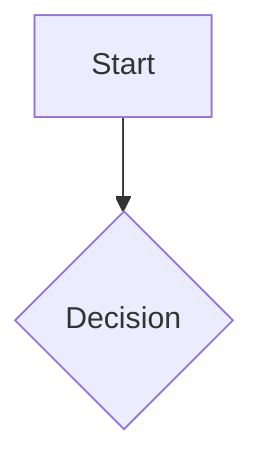

# Screening Decision Flow Builder

## Purpose

Convert lease screening criteria into a compact decision flow that can be read, discussed, and later implemented or diagrammed.

## Workflow

Reason: screening flows become unusable when they mix facts, questions, and decisions without explicit branches.
Scope: use for lease screening decision maps and confirmation flows.
Retirement: remove if a formal rules engine becomes the source of truth for screening flows.

1. Identify nodes.
   - `start`: case entry condition.
   - `fact`: known case data.
   - `question`: missing or ambiguous information.
   - `decision`: branch point.
   - `action`: approve, condition, hold, reject, ask, monitor.
   - `end`: final state.

2. Keep the main path short.
   - Start with the highest-impact risk origin.
   - Use side branches for exceptional cases.
   - Avoid more than 9 nodes in the first version unless asked.

3. Separate risk origins.
   - Credit/repayment risk.
   - Asset/usefulness risk.
   - Sales/competition/transaction risk.
   - Documentation/compliance risk.
   - Model/input inconsistency risk.

4. Define branch labels.
   - Use concrete conditions: `DSCR weak`, `bank support confirmed`, `asset resale weak`, `competitor quote present`.
   - Avoid vague labels like `good` or `bad`.

5. Add implementation notes only if requested.
   - Mention candidate fields, UI buttons, or tests separately from the flow.

## Output

Use Markdown by default:

```markdown
## Decision Flow

1. [start] ...
2. [decision] ...
   - If ... -> [action] ...
   - If ... -> [question] ...

## Mermaid


## Notes
```

If the user asks for Excalidraw, output nodes, connectors, and layout instead of Mermaid.

## Constraints

- Do not imply automatic approval or denial unless the user explicitly asks for automation.
- Keep human review visible for high-impact credit decisions.
- Do not mix personnel evaluation with judgment-asset evaluation.
- If inputs are insufficient, make the missing information a `question` node rather than inventing facts.
