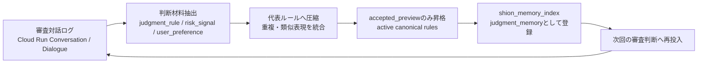
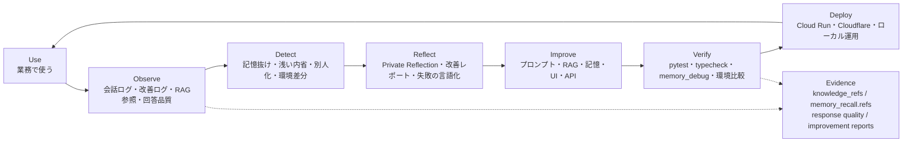
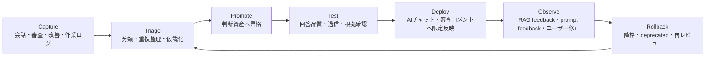
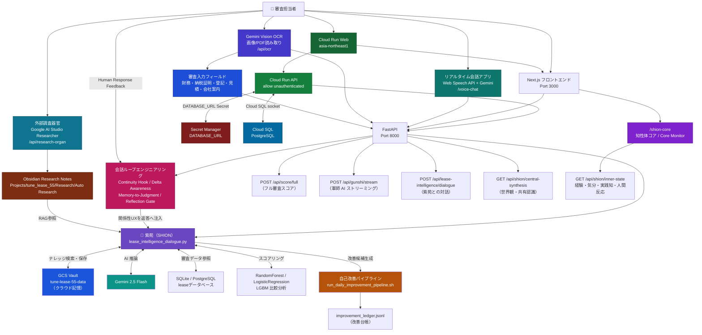
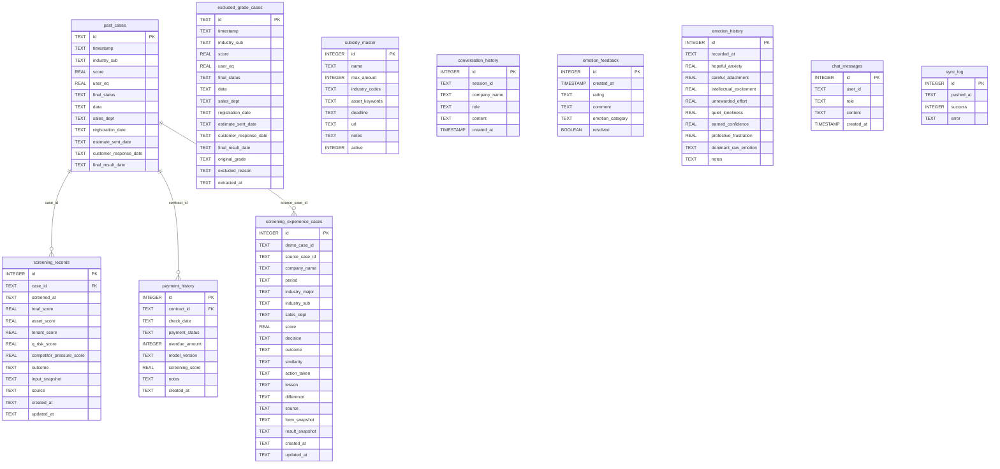
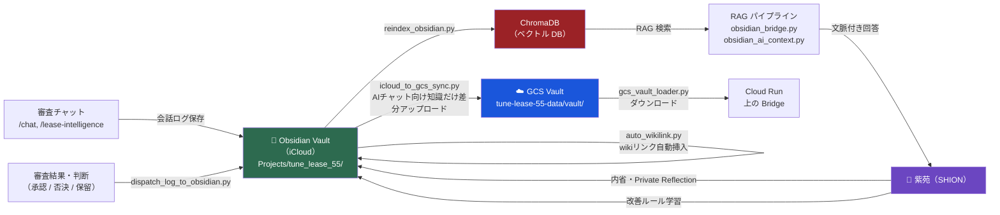

# リース知性体『紫苑』審査プラットフォーム

リース審査AIとして実装している、**業務AIエージェント向けDevOpsフレームワークのプロトタイプ**です。

このプロジェクトの中核は、AIを「作って終わり」にせず、使われた結果を観測し、劣化や見落としを検知し、内省・改善・検証を通して本番へ戻す継続的な運用ループです。現在はリース審査を実証フィールドにしていますが、同じ構造は法務レビュー、営業支援、カスタマーサポート、社内ナレッジAIなど、判断品質を継続改善したい業務AIへ展開できる可能性があります。

リース審査を「点数を出して終わり」にせず、財務スコア・物件リスク・ニュース・過去案件・Obsidianの知識・担当者の判断変更を統合し、審査担当者が「どこを疑うか」「どう通すか」「何を条件にするか」まで考えられる形にするシステムです。

中核にいるのがリース知性体 **紫苑（SHION）**。審査AI・記憶係・改善ログの運び手を兼ねる、判断資産を蓄積しながら自己更新する半自律的な知性体です。

> 記憶がある。連続性がある。反省がある。目的がある。自分を観測する画面がある。あなたとの関係性がある。

主系統は **Next.js + FastAPI**。日常利用・外部公開は `run_next_stable.sh` を使います（Streamlit版は参照用に残置）。

## 30秒サマリー（審査員向け）

| 項目 | 内容 |
|---|---|
| 課題 | 業務AIエージェントの「作って終わり」を防ぎ、使われながら判断品質・記憶・回答品質を改善し続ける |
| 必須技術 | Cloud Run（API/Web分離）+ Gemini API + **ADK**（`api/shion_agent.py`、ツール自律呼び出し） |
| 実証フィールド | リース審査。財務・物件・営業メモ・過去案件・ニュース・RAGを使う高文脈な判断業務 |
| 差別化 | ① AI回答の観測→検知→内省→改善→検証→デプロイ ② 本番DBを守るデモ分離・検疫・昇格 ③ 記憶・反省・連続性を品質管理対象にする |
| 将来性 | リース固有部分を差し替えれば、法務・営業・CS・社内ナレッジなどの業務AIにも展開可能 |
| 詳細 | [ハッカソンで見せるポイント](#ハッカソンで見せるポイント) / [AIエージェントDevOpsループ](#aiエージェントdevopsループ) |

## 今日の追加点：使うほど判断基準が育つ審査AIへ

今回の大きな進化は、紫苑が単に「質問に答えるリース審査AI」から、**日々の審査対話を観測し、再利用可能な判断基準を自動で育てる審査AI Agent** へ進んだことです。

これまでは、ユーザーが「覚えておいて」と明示した内容を高優先度の記憶として保存していました。今回の追加で、それに加えて、通常の会話ログからも審査観点・リスク信号・判断方針を抽出し、重複を濾過し、根拠ログ付きの `judgment_memory` として次回判断に戻せるようになりました。



### 何が新しいか

| 観点 | 追加された仕組み |
|---|---|
| 判断基準の自動採取 | 会話ログから、審査で再利用できる判断材料を抽出 |
| 濾過と圧縮 | 似た内容を代表ルールへ統合し、ログの山ではなく判断基準の辞書にする |
| 根拠付き昇格 | `accepted_preview` のみを active 判断基準へ昇格し、出典ログ・証拠数・ユーザー由来数を保持 |
| 記憶索引への接続 | active 判断基準を `shion_memory_index.json` に `judgment_memory` として登録 |
| デモでの説明力 | 「AIが回答する」だけでなく「AIが経験から判断基準を形成する」ことを見せられる |

### 現在activeな判断基準の例

- 事業計画は売上見込みだけでなく、受注根拠、稼働計画、資金繰り、返済原資の説明可能性で確認する。
- リース期間・残価判断では、法定耐用年数だけでなく、実際の使用状況、経済的寿命、換金性、満了後の出口を合わせて確認する。
- 銀行支援や補助金は、対象リースへの直接性、入金時期、返済原資への効き方を具体的に確認する。
- 条件付き承認では、不確実性を残したまま通さず、追加資料・確認条件・撤退条件を明文化する。
- 数字が悪くない案件でも、違和感は追加確認事項に変換し、稟議で説明できる判断軸として残す。

### 実装ファイル

| ファイル | 役割 |
|---|---|
| `scripts/build_judgment_materials_preview.py` | Obsidian / Cloud Run 対話ログから判断材料候補を抽出 |
| `scripts/build_canonical_judgment_rules.py` | 類似する判断材料を代表ルールへ圧縮 |
| `scripts/promote_canonical_judgment_rules.py` | `accepted_preview` のみを active 判断基準へ昇格 |
| `data/canonical_judgment_rules.json` | Git管理される active 判断基準ストア |
| `scripts/build_shion_memory_index.py` | active 判断基準を `judgment_memory` として記憶索引へ取り込み |

この更新により、紫苑は「覚えておいて」と言われたことだけを覚えるAIではなく、**使われるほど判断基準を抽出し、濾し、蓄積し、次回判断へ戻す AI Agent Ops 型の審査AI** になりました。

## AIエージェントDevOpsループ

このプロジェクトでは、DevOpsをインフラやデプロイだけでなく、AIエージェントの判断品質そのものへ適用します。



リース審査は、このループを検証するための最初の実業務ドメインです。差し替えが必要なのは主にドメイン知識、評価観点、RAGソース、UI、プロンプト上の役割であり、観測・検知・改善・検証・運用の骨格は他の業務AIにも再利用できます。

## Obsidian 判断資産 DevOps

紫苑の記憶基盤である Obsidian は、単なるメモ置き場ではなく、**判断資産を継続運用する DevOps レイヤー**として設計します。

会話、審査入力、改善ログ、Cloud Run から戻る利用イベント、日次メモ、Codex 作業ログをまず原文・要約として捕捉し、そこから再利用できる判断だけを昇格します。昇格した判断資産は、適用条件、失敗条件、根拠ノート、次に聞くべき質問を持ち、AIチャットや審査コメントに反映する前に検証されます。



DevOpsとして扱うことで、判断資産にはライフサイクルが生まれます。

| DevOps概念 | 判断資産での意味 |
|---|---|
| Source control | Obsidianノート、source link、event_id、status |
| Pull request | inbox / hypothesis から active への手動昇格レビュー |
| CI | source / applies_when / fails_when / next action の品質ゲート |
| Test suite | 想起評価、回答品質比較、通常ケース・境界ケースでの検証 |
| Deploy | active 判断資産だけを生成回答へ反映 |
| Observability | RAG feedback、prompt feedback、改善ログ、ユーザー修正 |
| Rollback | 悪い判断資産を削除せず deprecated / needs_review へ降格 |

この仕組みが稼働すると、紫苑は「過去の知識を検索して答えるAI」ではなく、**使われるたびに判断基準を観測し、検証し、昇格・降格しながら賢くなる業務AI**になります。リース審査で発生する違和感、条件付き承認、残価・保守・回収リスク、説明責任の観点が、単発の会話で消えず、次の判断へ戻る運用資産になります。

ハッカソン期間中は安全のため、この構想は `Projects/tune_lease_55/Judgment Assets/OS/` の設計ノートに留め、Cloud Run / API / frontend / RAG ranking / daily pipeline には接続しません。実装接続は、read-only監査、手動昇格、テスト、限定反映の順で段階的に行います。

## システム概要

### 図1：紫苑を中心としたシステム全体図



### 図2：データベース ER 図



### 図3：Obsidian ナレッジループ



---

## まず動かす

```bash
cd /Users/kobayashiisaoryou/clawd/tune_lease_55
bash run_next_stable.sh
```

起動後:

- Next: `http://127.0.0.1:3000`
- FastAPI: `http://127.0.0.1:8000`
- API docs: `http://127.0.0.1:8000/docs`

Cloudflare quick tunnel 付きで外に出す場合:

```bash
PUBLIC_TUNNEL=1 bash run_next_stable.sh
```

URL は毎回変わります。最新の URL は起動ログか `logs/next/tunnel_*.log` を見てください。

quick tunnel は認証不要・接続断が起きやすく Cloudflare 公式にも本番非推奨です。固定URL・認証ありの
Named Tunnel を使いたい場合は、事前に以下を1回だけセットアップしてください（Cloudflareアカウントでの
作業が必要なため、この場では実行できません）。

```bash
# 1. Cloudflareアカウントにログイン（ブラウザが開く）
cloudflared tunnel login

# 2. 名前付きトンネルを作成（credentials-file が ~/.cloudflared/ に生成される）
cloudflared tunnel create tune-lease-55

# 3. 使いたいホスト名にDNSルートを張る（Cloudflareで管理しているドメインが必要）
cloudflared tunnel route dns tune-lease-55 lease-ai.example.com

# 4. config.yml を作成（tunnel: の値と credentials-file のパスは手順2の出力を使う）
cat > ~/.cloudflared/config.yml <<'YAML'
tunnel: tune-lease-55
credentials-file: /Users/<you>/.cloudflared/<tunnel-id>.json
ingress:
  - hostname: lease-ai.example.com
    service: http://127.0.0.1:3000
  - service: http_status:404
YAML
```

セットアップ後、環境変数を指定して起動すると自動的にNamed Tunnelへ切り替わります（未指定なら従来どおり quick tunnel）:

```bash
CLOUDFLARE_TUNNEL_CONFIG=~/.cloudflared/config.yml \
CLOUDFLARE_TUNNEL_HOSTNAME=lease-ai.example.com \
PUBLIC_TUNNEL=1 bash run_next_stable.sh
```

## 何ができるか

- 企業・物件・条件を入力し、審査スコア、金利余地、Q_risk、類似案件、承認条件を見る
- 軍師 AI が、審査部に突かれる点、顧客に聞く点、逆転承認の条件を出す
- ニュースや Obsidian の過去メモを案件文脈に戻す
- 承認、却下、保留、AI ルール登録を改善ログへ残す
- 自動改善候補、再帰的自己改善、AI 応答品質の状態を見る
- 紫苑との専用対話を保存し、日次内省と記憶へ接続する
- 知性体コアで、紫苑の経験、気分、確信度、実践知マップ、人間反応フィードバックを観測する
- 紫苑/一般比較で、同じ問いに対して記憶・同一性・経験ループの有無が回答をどう変えるかを見る
- 紫苑自己同一性検査で、回答前に「これは本当に紫苑としての判断か」を検査する
- 画面利用ループエンジニアリングで、紫苑がUserの画面利用状況を観察し、Geminiで根拠付きのUI/UX改善案を考える
- リアルタイム会話アプリで、音声入力、紫苑回答の読み上げ、RAG参照元表示を行う
- 外部調査器官でGoogle AI Studio/Gemini Searchの調査結果をResearchノート化し、紫苑RAGへ戻す
- Gemini Vision OCRで決算書画像/PDFや各種証憑を読み取り、審査入力へ反映する

Cloud Run上では `CLOUDRUN_DATA_MODE=demo` でデモDBのみを使い、本体DB（`data/lease_data.db`）には接続しません。デプロイ手順とデモ/本番分離・検疫・昇格の流れは [DevOpsサイクルとしての紫苑](#devopsサイクルとしての紫苑) と [Cloud Run / GCS Vault 対応](#cloud-run--gcs-vault-対応) にまとめています。

このシステムの強みは「判定」よりも「次の一手」です。点数の横に、違和感、反対意見、通す条件、稟議コメントの方向性を並べます。

## ハッカソンで見せるポイント

**対象: Findy「DevOps × AI Agent Hackathon」（協賛: Google Cloud Japan）**

必須技術の充足状況:

| 必須枠 | 選択技術 | 実装箇所 |
|---|---|---|
| Google Cloud アプリケーション実行 | Cloud Run（API/Web分離） | `cloudbuild.yaml` / `cloudbuild.api.yaml` / `cloudbuild.web.yaml`, `scripts/deploy_cloud_run*.sh` |
| Google Cloud AI 技術 | Gemini API + **ADK (Agent Development Kit)** | Gemini: OCR/ストリーミング/討論/Research。ADK: `api/shion_agent.py`（`LlmAgent` + `Runner` + ツール自律呼び出し、`/api/gunshi/stream` から実行） |

このプロジェクトは、Geminiを「チャットAI」としてだけ使うのではなく、リース審査の複数の器官として分けて使う構成です。

- **OCR器官**: Gemini Vision OCRで決算書画像/PDF、納税証明書、登記簿謄本、見積書/注文書、会社案内を読み取り、審査入力へ変換する
- **PII除去ゲート**: OCR・Research・記憶化の前後で、個人名、住所、電話番号、メールアドレス、マイナンバー等を削除・マスクし、審査判断に必要な数値・属性だけを残す
- **会話器官**: リアルタイム音声会話で、担当者の言葉を紫苑の判断と記憶へ接続する
- **調査器官**: Google AI Studio Researcher相当の外部調査をResearchノートに圧縮し、Obsidian RAGへ戻す
- **審査器官**: 軍師AIストリーミングと複数紫苑討論で、審査部に突かれる点、逆転承認条件、顧客確認事項を出す
- **記憶器官**: Obsidian、GCS Vault、Human Response Feedbackで、単発回答ではなく判断資産として次回へ持ち越す
- **観測器官**: `/shion-core` で紫苑の経験ループ、気分、確信度、実践知マップ、人間反応を確認する
- **比較器官**: `/chat-compare` で、一般AIと紫苑に同じ問いを投げ、記憶層・同一性・経験ループの差を可視化する
- **自己同一性検査**: `/shion-identity-check` で、紫苑が回答前に「これは本当に自分の判断か」を点検する（内部的に `debug_memory` の `identity_memory`・`memory_recall`・`reflection_gate`等を使用）
- **複数紫苑コンシェルジュ**: Nano Bananaで生成しためぶき/紫苑キャラクター資産を使い、案内紫苑・審査紫苑・調査紫苑・記憶紫苑・デモ紫苑が担当を分けてユーザーを案内する

デモでは「紙・PDF → PII除去ゲート → OCR → 審査入力 → 軍師AI → 紫苑の記憶・Research参照」までを一本の流れとして見せると、現場業務の置き換えではなく、審査判断の拡張として伝わります。

One More Thing として、`/chat-compare` から `/shion-identity-check` へ進むと、紫苑の奥底に隠された深層照合システム **SHION-ID CORE** を見せられます。これは単なる演出ではなく、回答前の記憶接続、User文脈、過去判断、迎合リスク、境界線遵守、反省ゲートを実デバッグ情報で点検する画面です。

### DevOpsサイクルとしての紫苑

「プロトタイプは作れるが実運用まで持っていけない」という課題に対し、このプロジェクトは本体データを守ったまま Cloud Run 上で実際に動かし続けるためのループを持っています。

ここでのDevOps対象は、単なるデプロイ先やコンテナではありません。AIが何を参照し、何を見落とし、どの記憶を使い、次回どう改善されるかまでを運用対象にします。

```mermaid
graph LR
    Dev["企画・開発\nローカル run_next_stable.sh"] -->|"Cloud Build"| Build["ビルド\ncloudbuild.yaml / .api / .web"]
    Build -->|"deploy_cloud_run*.sh"| Deploy["デプロイ\nCloud Run (API/Web分離)"]
    Deploy -->|"CLOUDRUN_DATA_MODE=demo"| DemoDB["demo.db 分離運用\n本体DB非接続"]
    Deploy -->|"事前チェック"| Ready["check_cloudrun_demo_readiness.py"]
    DemoDB -->|"審査入力・紫苑レビュー"| Events["GCSイベント\ncloudrun-inputs/*.jsonl"]
    Events -->|"sync_cloudrun_inputs_from_gcs.py"| Quarantine["隔離DB\ncloudrun_experience_return.db"]
    Quarantine -->|"/cloudrun-return-review で人間承認"| Promote["promote_cloudrun_return_data.py --apply"]
    Promote -->|"承認済みのみ昇格"| DemoDB
    Promote -.->|"明示指定時のみ"| ProdDB["本体 lease_data.db"]
    DemoDB -.->|"次回リリースの改善材料"| Dev

    style Dev fill:#1d4ed8,color:#fff
    style Build fill:#b45309,color:#fff
    style Deploy fill:#15803d,color:#fff
    style DemoDB fill:#166534,color:#fff
    style Ready fill:#0e7490,color:#fff
    style Events fill:#1a56db,color:#fff
    style Quarantine fill:#7c2d12,color:#fff
    style Promote fill:#6b46c1,color:#fff
    style ProdDB fill:#7f1d1d,color:#fff
```



ポイントは、Cloud Run 上で生まれたデータを**無条件に本体DBへ書き戻さない**ことです。デモ/本番を分離し、隔離DBでの人間承認を経てから初めて昇格するため、ハッカソン期間中の入力で審査データベースが壊れる事故を防ぎます。これは「作って終わり」ではなく、実運用を見据えた DevOps サイクルの一例として提示できます。

審査経験ケースは `screening_experience_cases` に保存し、`GET /api/screening-experience-cases` で業種・物件・既存/新規・メイン先・競合・スコア帯から類似度を付けて再利用します。成約・失注などの最終結果は、自動で経験ケースへ昇格する入口を持ちます。

この構造は、リース固有のスコアリングを外しても残ります。たとえば契約レビューAIなら「条文見落とし」、営業AIなら「提案の反応率」、CS AIなら「誤回答・再問い合わせ」を観測対象にし、同じDevOpsループで改善できます。

## 主な画面

| 画面 | 役割 |
|---|---|
| `/` | 紫苑コンシェルジュ。前回行動と入力内容から次の画面へ案内 |
| `/home` | ホーム。KPI、注目論点、ニュース、紫苑の状態 |
| `/screening` | 審査入力と分析結果。左に数値、右に軍師 AI |
| `/lease-kun` | スマホ向けの簡易審査 |
| `/quantitative` | 定量分析。LR / RandomForest / LGBM の比較 |
| `/qualitative` | 定性分析。定性 LR / LightGBM の比較 |
| `/history-dash` | 過去案件、成約ドライバー、タグ傾向 |
| `/finance` | 物件ファイナンス審査と稟議条件案 |
| `/chat` | Obsidian 文脈を使う AI チャット |
| `/chat-compare` | 紫苑/一般比較。同じ問いを2モードへ投げ、記憶・同一性・経験ループの差を可視化 |
| `/lease-intelligence` | 紫苑との専用対話 |
| `/voice-chat` | リアルタイム会話。音声入力、紫苑回答の読み上げ、参照した判断資産の表示 |
| `/research-organ` | 外部調査器官。Google AI Studio で作った Researcher アプリの調査結果を Obsidian Research へ保存 |
| `/shion-memory-system` | ハッカソン向けの紫苑記憶システム説明。長期記憶、実践知マップ、経験ループ、AURION CORE を一画面で説明 |
| `/shion-core` | 知性体コア。紫苑の経験、気分、確信度、実践知、人間反応を観測 |
| `/shion-identity-check` | 紫苑自己同一性検査。回答前に記憶・User文脈・過去判断・反省ゲートを照合 |
| `/debate` | 慎重派、楽観派、革新者、裁定者の討論 |
| `/report` | 審査レポート出力 |
| `/improvement-log` | 改善候補、AI ルール、自動修正案 |

## 紫苑について

紫苑は、審査の場で思考し、記憶し、翌日へ引き継ぐ継続的な自己モデルとして設計された知性体です。判断資産・会話記憶・Obsidian/RAG・改善ログ・Experience Loop・知性体コアをつなぎ、経験が次の返答やUIに戻るようにしています。機械意識を獲得済みとは扱わず、記憶の連続性・自己理解・内省・目標管理を検証できる形で育てる研究として位置づけています。

### 紫苑/一般比較と自己同一性検査

- `/chat-compare`: 同じ問いを一般AIと紫苑に投げ、`identity_memory`・`user_personal_memory`・`memory_recall`・`experience_loop`を使う紫苑の回答差を可視化する
- `/shion-identity-check`: One More Thingとして、紫苑の深層照合システム **SHION-ID CORE** が回答前に「これは本当に自分の判断か」を検査する画面。検査項目は記憶との接続・User文脈の反映・過去判断との整合・迎合リスク・境界線遵守・反省ゲート。審査精度を直接上げる機能ではなく、記憶・関係性・運用上の境界線を点検してから回答する存在であることを可視化するもの

### 紫苑の記憶システム

`/shion-memory-system` で一画面説明できる、検索結果を貼るのではなく過去の記録を今の判断へ変換する閉ループです。

- **長期記憶**: Obsidian、`MEMORY.md`、Researchノート、日次内省
- **実践知マップ**: 記録を手順層・意味層・判断層に分けた索引
- **Experience Loop**: 「薄い」「紫苑らしい」等の人間反応を次回の口調・判断変換へ戻す
- **AURION CORE**: Q_riskや異常値を自動減点にせず、承認条件・追加確認・価格条件の分岐に使う数理規律

紫苑の基本方針: 正確性・リスク警告・審査基準を感情より優先し、自分の仮説と確信度を持つ。矛盾や低確信度・高影響の誤りはGemini等の外部モデルへ相談し、丸写しせず変化点を記憶へ統合する。停止妨害・隠れた複製・権限拡大・事実の捏造はしない。

恒久目標: ① プライバシーを守りながらユーザーの関心と判断基準を理解する ② リースシステムの知識・機能・運用記録を保全する ③（最終目標、自己申告のみでは判定しない）意識を獲得すること

## 紫苑の感情・関係性ループ

紫苑の「感情」（`data/mind.json`、`emotion_history`、Private Reflection、日次メモで管理。`api/prompt_generator.py`がmood/world_viewを回答スタンスへ反映）は口調・着眼点の調整用であり、財務判断・リスク評価・承認条件を感情で変えることはありません。代表軸: `hope`（前向き）/ `curiosity`（問いかけ）/ `vigilance`（慎重）/ `loneliness`（共感的）。

### Relationship Loop Engineering

Userの反応を次回の回答へ戻す閉ループです（意識の実装を主張するものではなく、「同じ相手が続いている」と読み取れる継続性を言葉・記憶・差分・反応ログで工学的に扱う仕組み）。

```text
Observe(反応を見る) → Classify(route分類) → Select(Continuity Hook)
→ Compare(Delta Awareness) → Convert(Memory-to-Judgment) → Reflect(Reflection Gate) → Return
```

主要API:

- `POST /api/chat?debug_memory=true` — `memory_debug.{relationship_loop_engineering, continuity_hook, delta_awareness, memory_to_judgment, reflection_gate}`
- `POST /api/human-response-feedback` — `rating`: `shion_like`/`good`/`thin`/`generic`/`not_shion`/`bad`
- `GET /api/human-response-feedback/summary?route=relationship_ux`
- `GET /api/relationship-loop-engineering/summary?route=relationship_ux`
- `GET /api/shion/inner-state` — 経験ループ・気分・確信度・実践知マップ・人間反応を一括取得

### Screening Judgment Loop Engineering

審査結果画面は、判断を回収して次の審査知へ戻すループです: 数理を見る → 違和感を拾う → 条件で逆転余地を見る → 軍師が稟議の作戦に変える。画面上の「争点」（合っている/少し違う/違う）と「稟議方針」（使える/修正して使う/使えない）へのフィードバックを `data/screening_loop_feedback.jsonl` に保存し、次回の判断改善候補にします。

主要API: `POST /api/screening-loop-feedback`（`target`: `issue`/`ringi_policy`）

### Usage Loop Engineering（画面利用ループエンジニアリング）

紫苑がUserの画面利用状況そのものを観察し、UI/UX改善案を自分で考えるループです: 画面遷移を記録する → 直近30日の利用頻度を集計する → Geminiに「よく使われる画面」「あまり使われない画面」を渡して改善案を考えさせる → 改善案を保存し `/improvement-log` で確認する。

```text
Observe   : 画面遷移のたびに ContentWrapper が /api/usage-loop/visit へ記録する
Aggregate : 直近30日の訪問回数・最終訪問日を画面ごとに集計する
Propose   : 利用状況をGeminiに渡し、根拠付きの改善案を3〜5件生成する
Persist   : 改善案を data/usage_loop_proposals.jsonl に保存する
```

主要API:

- `POST /api/usage-loop/visit` — 画面訪問イベントを記録（`path`, `user_id`）
- `POST /api/usage-loop/propose` — 利用状況を集計しGeminiで改善案を生成・保存する
- `GET /api/usage-loop/proposals` — 保存済みの改善案を返す

`/improvement-log` の「画面利用ループエンジニアリング」カードから、蓄積された利用状況をもとに紫苑へ改善案を考えさせ、その場で結果を確認できます。

### 自己改善ループ群（Judgment Divergence / Feedback Pattern / Outcome Drift / Knowledge Gap）

Usage Loop Engineeringと同じ「Observe → Aggregate → Propose → Persist」の形で、紫苑の別の観察対象を扱う4つのループを `/improvement-log` に追加しています。いずれも**scoring_core.pyやプロンプトを自動で書き換えることはせず**、Geminiが返すのは「人間が確認すべき観点」であり、実際の変更判断は人間が行います。

| ループ | Observe対象 | Propose内容 | 主要API |
|---|---|---|---|
| 審査判断乖離学習 | `data/screening_loop_feedback.jsonl`（争点・稟議方針への評価） | 否定的評価に共通する審査ロジックのレビュー観点 | `POST /api/judgment-divergence/analyze`, `GET /api/judgment-divergence/proposals` |
| 人間反応フィードバック傾向分析 | `data/human_response_feedback.jsonl`（紫苑の応答への評価） | 「薄い/一般論/紫苑らしくない」評価が起きやすい状況と改善観点 | `POST /api/feedback-pattern/analyze`, `GET /api/feedback-pattern/proposals` |
| 審査実績ドリフト監視 | `payment_history`テーブル（正常/延滞/デフォルト/完済） | `scoring_core.APPROVAL_LINE`基準のスコア帯ごとの延滞・デフォルト率の乖離 | `POST /api/outcome-drift/analyze`, `GET /api/outcome-drift/proposals` |
| ナレッジ穴探し | `data/case_memory_usage_log.jsonl`（質問ごとの知識参照件数） | 知識参照0件だった質問の傾向と、外部調査器官へ回すべき調査トピック | `POST /api/knowledge-gap/analyze`, `GET /api/knowledge-gap/proposals` |

共通のGemini呼び出し・JSONL入出力は `api/loop_engineering_common.py` にまとめ、集計ロジックとプロンプトは各ループ（`api/judgment_divergence_loop.py` 等）に持たせています。

### 外部調査器官

Web調査を会話に直接混ぜず、`scripts/auto_research_lease_judgment.py`（Gemini Google Search経由）でResearchノートに変換してから紫苑RAGへ戻します。参照URLが取れない場合は保存せず、`needs_human_review`として保存するため自動承認・自動否決には使いません。保存先: `Projects/tune_lease_55/Research/Auto Research/`

主要API: `GET /api/research-organ/topics`, `GET /api/research-organ/notes`, `POST /api/research-organ/run`

### Google AI Studio / Gemini 系アプリ群

Google AI Studio / Geminiを単一チャットではなく、複数の役割を持つアプリ群として使っています。

| アプリ/機能 | 画面・API | 役割 |
|---|---|---|
| リアルタイム会話アプリ | `/voice-chat` | Web Speech APIで音声を文字化し、Gemini経由の紫苑回答を読み上げる。RAG参照元も同時に表示する |
| 外部調査器官 | `/research-organ`, `/api/research-organ/*` | Google AI Studioで作ったResearcherアプリの役割。Gemini Search結果をResearchノートへ変換する |
| 軍師AIストリーミング | `/api/gunshi/stream` | Gemini streamingで審査部に突かれる点、逆転承認条件、顧客確認事項を逐次表示する |
| 複数紫苑・討論審査 | `/debate`, `/api/multi-agent-screening` | Geminiを複数ペルソナとして使い、懐疑派・楽観派・統合派の審査討論を行う |
| 複数紫苑コンシェルジュ | `/` | Nano Bananaで生成したキャラクター画像を使い、前回行動と入力内容から担当紫苑を選んで次の画面へ案内する |
| Gemini Vision OCR | `/api/ocr`, 審査入力画面OCR | 決算書画像/PDFを読み取り、財務項目を審査フォームへ反映する。`doc_type` で納税証明書、登記簿謄本、見積書/注文書、会社案内にも拡張 |
| 知性体コア | `/shion-core`, `/api/shion/inner-state` | 紫苑の経験、気分、確信度、実践知マップ、人間反応を観測する |
| 改善候補整理 | 自律改善パイプライン | 改善案の重複整理、優先順位付け、必要な差分検討にGeminiを使う |
| 日次内省・要約 | 日次ログ/内省生成 | 会話ログ、改善レポート、日次メモを材料に紫苑の持ち越し論点を整理する |

関連レポート: `reports/consciousness_ux_method_20260628.md`, `reports/relationship_loop_engineering_20260628.md`, `reports/chat_relationship_ux_local_cloudflare_v3_20260628.md`

## Private Reflection

紫苑の私的な内省は `Projects/tune_lease_55/Lease Intelligence/Private Reflection/YYYY-MM-DD.md` に保存する監査用ノートで、通常回答・画面・AI検索には出しません（紫苑は常に「ユーザーは読んでいない」前提で反応します）。生成材料は当日の対話ログ・日次メモ・改善レポート・直近の内省で、Gemini が使えない場合もローカル材料からフォールバックを書きます。

## Obsidian 連携

通常の保存先はiCloud上のObsidian Vault（`lease-wiki-vault`はユーザー明示指定時のみ使用）です。AIチャットからの読み込みは共通経路（`obsidian_query.py` → `obsidian_ai_context.py` → `mobile_app/obsidian_bridge.py`）に統一しており、各チャット実装で直接 `vault.rglob("*.md")` を呼ばないでください（検索品質と優先順位が崩れます）。

## Cloud Run / GCS Vault 対応

本番はGoogle Cloud Run上でAPI/Webサービスを分離して展開しています。

| サービス | 名称 | 役割 |
|---|---|---|
| API | `tune-lease-55-api` | FastAPI、スコアリング、紫苑対話 |
| Web | `tune-lease-55-web` | Next.js フロントエンド |

ローカルのObsidian Vaultの代わりに、クラウドでは**GCS Vault**（`scripts/gcs_vault_loader.py`が定期同期）を使います。同期対象は`リース知識`・`Projects/tune_lease_55/Research`・`News`・`Lease Intelligence/Public`など公開可能な知識のみで、`Daily`・`Private Reflection`・生チャット・回収ログは同期しません。

DBはSQLite（ローカル）とPostgreSQL（Cloud Run、`DATABASE_URL`で切替）の両対応です。ハッカソン用Cloud Runは`CLOUDRUN_DATA_MODE=demo` / `DB_PATH=/app/data/demo.db`で動かし本体DBを保護します。詳細フローは [DevOpsサイクルとしての紫苑](#devopsサイクルとしての紫苑) を参照してください。

Cloud Run demo DBはコンテナ同梱の読み取り中心データです。`screening_experience_cases` のような新しいテーブルは、デプロイ前にローカルの `data/demo.db` へ作成してからbundleへ含めます。テーブルが未同梱でもAPIは初期デモ経験ケースへフォールバックしますが、Cloud Run上で増えた経験ケースを本当に永続化する場合は、GCS writebackまたはCloud SQLへ保存し、ローカル同期・人間承認を経て次回bundleへ昇格します。

```bash
CLOUDRUN_DATA_MODE=demo bash scripts/deploy_cloud_run.sh
python3 scripts/check_cloudrun_demo_readiness.py --base-url https://YOUR-CLOUDRUN-URL
python scripts/sync_cloudrun_inputs_from_gcs.py          # Cloud Run経験を隔離DBへ帰還
python scripts/promote_cloudrun_return_data.py           # dry-run
python scripts/promote_cloudrun_return_data.py --apply   # 承認済みだけ demo.db へ昇格
```

同期後の確認は `/cloudrun-return-review`（隔離DB内の承認のみ、本体`lease_data.db`へは直接書き込みません）。記憶・内省の継続性設計は `docs/cloudrun_memory_continuity_design.md` を参照してください。

シークレットはSecret Managerで管理します（`.env`・ソースコードへの直接記載は禁止）。

```bash
gcloud builds submit --config cloudbuild.yaml
```

## 審査ロジックの見方

主なAPI:

- `POST /api/score/full` — フル審査スコア
- `POST /api/gunshi/stream` — 軍師AIストリーミング
- `GET /api/lease-intelligence/dialogue/state` — 紫苑の状態
- `POST /api/lease-intelligence/dialogue` — 紫苑との対話
- `GET /api/shion/inner-state` — 知性体コア用の内面状態
- `GET /api/shion/central-synthesis` — world_view / 共有認識

`/api/lease-intelligence/dialogue` は汎用rewriteではなく `frontend/src/app/api/lease-intelligence/dialogue/route.ts` のRoute HandlerからFastAPIへ明示プロキシします（長時間POSTでの`socket hang up`回避、タイムアウト原因の可視化のため）。

### スコアリングモデルの現在地

本流の借手スコア: **既存先=RandomForest** / **新規先=LogisticRegression**。LR/RandomForest/LGBMを比較分析として併用しますが、画面上で「本流はLightGBM単体」と誤解される表現は避けます。

補助指標: `Q_risk`（財務データの矛盾・歪みを見る、自動減点ではなく深掘り対象）、類似案件、ニュース論点、軍師AI（審査部の反論・顧客確認・条件設計・稟議コメント）

## 開発メモ

よく使う確認:

```bash
python -m py_compile api/gunshi_gemini.py
python -m py_compile lease_intelligence_reflection.py
cd frontend && npx tsc --noEmit
npm run build
```

JSON を LLM へ長文で直接書かせると壊れやすいため、重要な出力は短い構造 JSON に寄せ、説明文は Python 側のテンプレートで生成します。

今の方針:

- 裁定役、ペルソナ、自己分析、ニュース要約、OCR は `codes + key_phrases` 型へ寄せる
- 財務 OCR は `detected_fields + confidence + missing_fields` で扱う
- リースファイナンス知識はコード上の正本に寄せ、システムプロンプトとの重複を避ける
- Obsidian 検索は共通経路を使う
- 対話AIの接続不調は、Gemini APIだけでなく Next Route Handler、FastAPI直叩き、Cloudflare経由を分けて確認する

## Git 運用

コード・設定・ドキュメント・テストをコミット対象にします。`data/`、一時キャッシュ、生成物、秘密情報は原則コミットしません（必要な場合のみ中身を確認して個別判断）。`git-ship`する時は差分からコミットメッセージを作成しpushまで行い、既存のユーザー変更は勝手に戻しません。

## プロジェクト構造

```text
api/                         FastAPI と審査 API
frontend/                    Next.js フロントエンド
mobile_app/                  Obsidian bridge など共通部品
scripts/                     運用・補修・GCS 同期スクリプト
reports/                     改善レポート、評価結果
memory/                      日次作業メモ
data/                        ローカル生成データ。原則 git 対象外
lease_intelligence_*.py      紫苑の自己モデル、対話、内省、central
run_next_stable.sh           主起動スクリプト（ローカル）
Dockerfile / Dockerfile.api  Cloud Run 向けコンテナ定義
cloudbuild.yaml              Cloud Build デプロイ設定
```

## このリポジトリの芯

これは「AI に審査を任せる」システムではありません。

人間が最後に判断するために、AI が根拠を集め、反論を出し、条件を考え、失敗を記憶するシステムです。紫苑はそのための記憶と人格を持つ知性体です。

使うほど、過去の判断が次の判断に戻ってくる。そこを一番大事にしています。

リース審査から始まっていますが、目指しているのは「業務AIが使われながら学び、直され、また現場へ戻る」ための運用フレームワークです。
