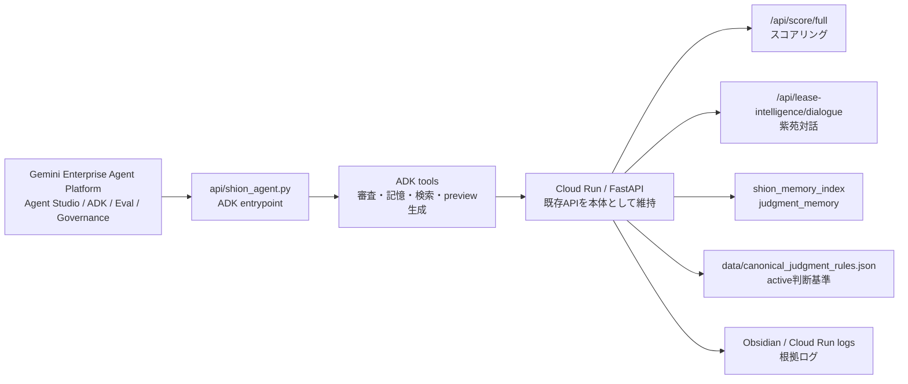

# Gemini Enterprise Agent Platform / ADK Adapter Plan

このメモは、リース知性体「紫苑」を Gemini Enterprise Agent Platform（旧 Vertex AI Agent Builder 系のエージェント基盤）へ接続するための設計方針です。

結論として、現時点では **Cloud Run / FastAPI の本体を移植しない**。紫苑の審査ロジック、記憶、判断基準、Obsidian同期、Cloud Run運用はそのまま残し、Agent Platform / ADK は外側のエージェント実行・評価・監視・ツール統制レイヤーとして使う。

## 現在の入口

すでに `api/shion_agent.py` が code-first の ADK エージェント入口になっている。

- `LlmAgent` と `Runner` で紫苑ADKエージェントを定義
- `get_industry_benchmark` で業種ベンチマークを取得
- `assess_risk_level` でスコア、PD、警告フラグからリスク判定
- `/api/gunshi/stream` からストリーミング実行し、失敗時は既存の軍師Geminiへフォールバック

つまり、Agent Platform へ寄せる場合も、ゼロから作り直すのではなく、この ADK 入口を育てる。

## 接続イメージ

## ツール候補

現在のADKツール:

- `get_industry_benchmark`: 業種別の財務ベンチマークを返す
- `assess_risk_level`: スコア、PD、警告フラグからリスク水準と判定を返す

次に追加する候補:

- `score_full_case`: 既存の `/api/score/full` 相当を呼び、案件の総合スコアを返す
- `stream_gunshi_review`: 軍師AIのレビューをツール化し、判断根拠を分解して返す
- `recall_judgment_memory`: `data/canonical_judgment_rules.json` と `shion_memory_index` から該当する `judgment_memory` を返す
- `search_obsidian_context`: 既存の共通経路を通じてObsidian文脈を検索する
- `build_judgment_preview`: 日次対話ログから判断材料previewを生成する

## 安全境界

Agent Platform は紫苑の「外側の司令塔」にする。source of truth は既存の Cloud Run / FastAPI / Git管理データに残す。

- active判断基準は自動昇格しない
- `promote_canonical_judgment_rules.py` は人間レビュー後だけ実行する
- 日次パイプラインは `judgment_materials_preview` と `canonical_judgment_rules_preview` まで
- Cloud Runへ反映する判断基準は、確認済みの `data/canonical_judgment_rules.json` のみ
- private reflection はデモ用公開文脈や審査APIの汎用RAGへ混ぜない
- Obsidian検索は `obsidian_query.py` / `obsidian_ai_context.py` / `mobile_app/obsidian_bridge.py` の共通経路を使う
- Agent Platform 側のサービスアカウントは最小権限にし、広い書き込み権限を与えない

## ハッカソンでの見せ方

この接続方針の強みは、「AIエージェントを作った」ではなく、**業務AIエージェントを運用し、観測し、評価し、判断基準として育てる基盤** だと説明できること。

- Cloud Run: 本番運用できるAPI/Web基盤
- Gemini API: OCR、対話、レビュー、審査コメント生成
- ADK: 紫苑をツール利用型エージェントとして動かす入口
- Agent Platform: 将来の評価、監視、ガバナンス、ツール統制の受け皿
- Obsidian / Git: 判断資産の根拠と履歴

いまやるべきことは、全面移行ではなく **Agent Platform-ready** にすること。これにより、審査AIの中核を壊さず、審査員には「このAIはクラウド上のエージェント運用基盤へ拡張できる」と伝えられる。
