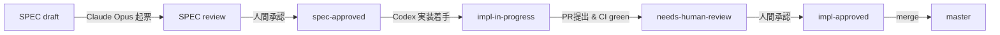

# Human Approval Gate ワークフロー

## 0. 概要図



## 1. ゲート①: SPEC 承認

1. Claude Opusが `specs/phaseN/PX-YYY-<slug>.md` を起票（`status: draft`）
2. 人間レビュアが内容を確認・コメントまたは直接修正
3. 合意後、frontmatterの `status` を `approved` に変更しコミット、`spec-approved` ラベルを付与

## 2. ゲート②: 実装承認

1. Codexが `specs/phaseN/PX-YYY-*.md`（`status: approved`）を読み、`feature/PX-YYY-*` ブランチで実装
2. `tests/spec_phaseN/test_PX-YYY.py` を作成し全AC-xxxに対応したpytestをgreen
3. PR起票（タイトル `[PX-YYY] ...`、本文はPRテンプレートに従う）
4. `needs-human-review` ラベルを付与
5. 人間レビュアがPRテンプレートのチェックリスト4項目を確認
6. 問題なければ `impl-approved` ラベル付与 → squash merge

## 3. 禁止リスト

| # | 操作 | 理由 |
|---|---|---|
| 1 | 既存の学習済みモデル（RandomForest / LGBM）ファイルの置換・上書き | 推論結果の再現性喪失 |
| 2 | `lease_data.db` への INSERT / UPDATE / DELETE の直接実行 | 監査ログ欠落 |
| 3 | `master` ブランチへの直接push / force push | レビュー回避 |
| 4 | SPEC に未記載の依存パッケージ追加 | 再現性・セキュリティ |
| 5 | APIキー・DB接続情報のリポジトリへのコミット | 情報漏洩 |
| 6 | port 5001以外へのデフォルトFlask起動変更 | 既存運用との衝突 |

## 4. 許可リスト

| # | 操作 | 条件 |
|---|---|---|
| 1 | SPECに明記されたカラム追加 / 新規テーブル作成 | migrationスクリプト同梱 |
| 2 | `scripts/` 配下への新規スクリプト追加 | SPEC記載 + テスト同梱 |
| 3 | `tests/spec_phaseN/` 配下のテスト追加・更新 | AC-xxxと対応 |
| 4 | `mobile_app/` 配下のHTML / JS / CSS のSPEC記載範囲の更新 | UIスクショ添付 |
| 5 | `.github/workflows/` の追加 | dry-run結果添付 |

## 5. GitHub Labels

| label | color | description |
|---|---|---|
| `spec-draft` | `#cccccc` | SPEC起票直後 |
| `spec-approved` | `#0e8a16` | SPEC承認済み |
| `impl-in-progress` | `#fbca04` | 実装中 |
| `needs-human-review` | `#d93f0b` | 人間レビュー待ち |
| `impl-approved` | `#1d76db` | 実装承認済み・マージ可 |
| `blocked` | `#b60205` | ブロック中 |

## 6. 例外運用

- 本番障害時は `hotfix-*` ブランチで対応 → 事後SPEC起票
- SPECの軽微誤字修正は `docs-fix-*` ブランチで人間が直接対応可（PR必須）

## 7. FAQ

- **Q: SPEC を分割すべき粒度は？** → A: 1 SPEC = 1 PRで完結する単位
- **Q: ラベルを付け忘れたら？** → A: マージ前に付与。マージ後はGitHub Issue化して追跡
- **Q: draftのSPECをCodexが先に実装し始めたら？** → A: PRをクローズし、approved後に再着手

## 付録: ラベル作成コマンド

```bash
gh label create "spec-draft"          --color cccccc --description "SPEC起票直後"
gh label create "spec-approved"       --color 0e8a16 --description "SPEC承認済み"
gh label create "impl-in-progress"    --color fbca04 --description "実装中"
gh label create "needs-human-review"  --color d93f0b --description "人間レビュー待ち"
gh label create "impl-approved"       --color 1d76db --description "実装承認済み・マージ可"
gh label create "blocked"             --color b60205 --description "ブロック中"
```
