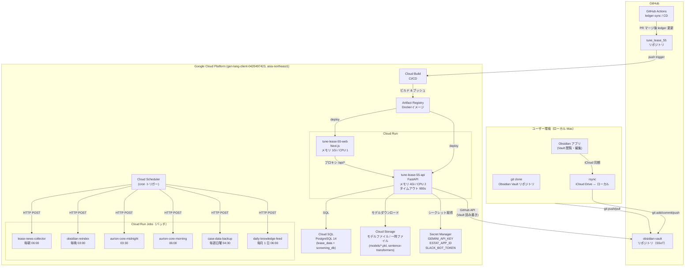
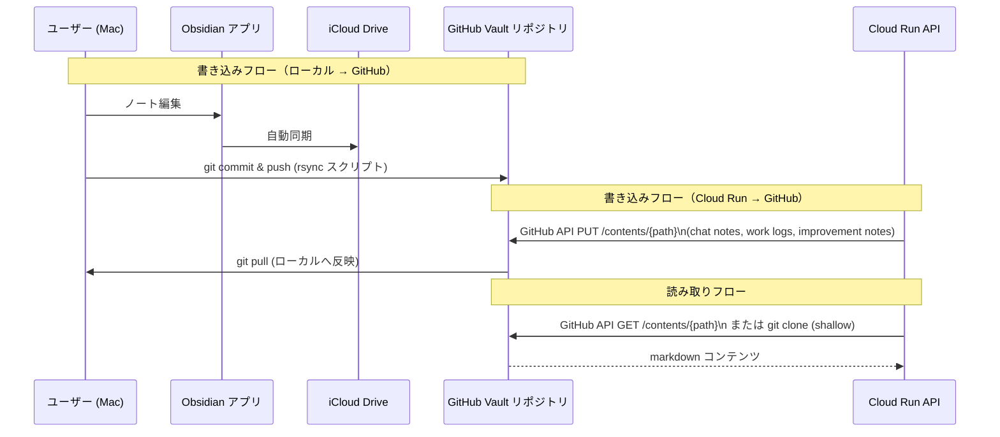
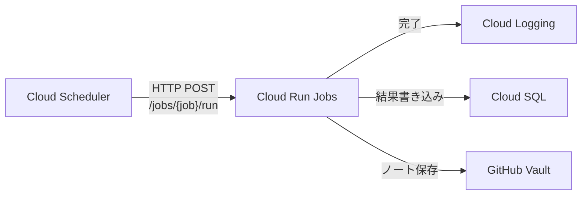

# Cloud Run 移行設計書

> 作成日: 2026-06-16  
> 対象ブランチ: `feat/rev-083-dynamic-keyword-extraction`  
> ステータス: **設計書（未実装）**

---

## 0. 現状サマリー

### すでに Cloud Run 対応は部分的に存在する

`CLOUD_RUN.md` / `scripts/deploy_cloud_run_api.sh` / `Dockerfile.api` / `cloudbuild.api.yaml` が既存で、
Cloud Run サービス `tune-lease-55-api`（FastAPI）と `tune-lease-55-web`（Next.js）の 2 サービス構成はすでに定義されている。

**しかし、以下の根本的な問題が未解決のまま残っている：**

| 問題 | 現状の回避策 | 本設計書での解消策 |
|---|---|---|
| SQLite はインスタンス再起動で消える | デプロイ時にバンドルしてコンテナに焼き込む（= スナップショット） | Cloud SQL (PostgreSQL) へ移行 |
| Obsidian Vault は iCloud パス直参照 | バンドル時に Vault の一部を `.cloudrun_bundle/obsidian_vault/` へコピー | GitHub SSoT 経由に切り替え |
| ML モデル (`models/*.pkl`) がローカルファイル | コンテナに含める（巨大イメージになる） | Cloud Storage (GCS) へ切り出し |
| LaunchAgent (macOS cron) が定期処理を担う | ローカル Mac に依存 | Cloud Scheduler + Cloud Run Jobs へ移行 |
| 同時実行 = 1 の制約（共有ファイル state） | `--concurrency 1 --max-instances 1` で回避中 | 共有 state を排除してスケール可能に |

---

## 1. 移行スコープ

### Cloud Run に移すもの

| 対象 | 現在の場所 | 移行先 |
|---|---|---|
| FastAPI (`api/main.py`, 7870 行) | ローカル uvicorn | Cloud Run サービス `tune-lease-55-api` |
| Next.js フロントエンド (`frontend/`) | ローカル next dev | Cloud Run サービス `tune-lease-55-web` |
| 定期バッチ処理（全 LaunchAgent） | macOS launchd (10 プロセス) | Cloud Scheduler + Cloud Run Jobs |
| シークレット管理 | `.streamlit/secrets.toml` (ローカルファイル) | Secret Manager |

### ローカルに残すもの（または別手段）

| 対象 | 理由 | 代替 |
|---|---|---|
| Obsidian の UI アプリ（閲覧・編集） | デスクトップアプリのため移行不要 | ローカルのまま。Vault は GitHub リポジトリを SSoT に |
| iCloud 同期 | Cloud Run からは不可 | `git pull` + `rsync` + iCloud Drive で代替 |
| Slack Bot (`slack_bot.py`) | Socket Mode はサーバーレスに不向き | Cloud Run 上でポーリング or HTTP Event mode に変更 |
| OCR スキャン取り込み (`scan/`) | ローカル操作 | 移行スコープ外。API 経由でアップロード済み |

---

## 2. アーキテクチャ図（移行後）

### 全体構成



### データフロー（Obsidian Vault SSoT）



---

## 3. ローカル依存の解消策

### 3-1. SQLite → Cloud SQL (PostgreSQL)

**現状**
- `data/lease_data.db`（主DB）と `data/screening_db.sqlite` の 2 ファイルを直接参照
- Cloud Run では `.cloudrun_bundle/data/` に焼き込んだスナップショットを `/app/data/` にコピーして使用（インスタンス再起動で消える）

**解消策**

```
[現在]
api/main.py
  └─ _LEASE_DB_PATH = get_data_path("lease_data.db")
       └─ sqlite3.connect(db_path)  ← ローカルファイル

[移行後]
api/main.py
  └─ DATABASE_URL = os.environ.get("DATABASE_URL")  ← Secret Manager or env
       └─ asyncpg / psycopg2 で接続  ← Cloud SQL (PostgreSQL)
```

**移行手順**
1. `migrate_to_sqlite.py` の逆方向スクリプト `migrate_to_postgresql.py` を作成し、既存データを PostgreSQL へ移行
2. Cloud SQL Auth Proxy を Cloud Run に組み込む（`--add-cloudsql-instances`）または Cloud SQL Connector（Python ライブラリ）を使用
3. `scoring_output_bridge.json`（物理ファイルブリッジ）→ PostgreSQL テーブルへ移行（同時実行 1 の制約を外せる前提条件）

**テーブル一覧（確認済み）**
- `past_cases`（`lease_data.db` にて必須テーブル確認済み）
- `screening_db.sqlite` 内テーブル

**コスト概算（Cloud SQL）**
| インスタンス | スペック | 月額（概算） |
|---|---|---|
| `db-f1-micro` | 0.6 GB RAM, 1 vCPU | 約 ¥1,000/月（asia-northeast1） |
| `db-g1-small` | 1.7 GB RAM, 1 vCPU | 約 ¥2,500/月 |

→ 1 ユーザー運用なら `db-f1-micro` で十分（審査データは高頻度アクセスではない）

---

### 3-2. Obsidian Vault → GitHub SSoT 経由

**現状**
- `OBSIDIAN_VAULT_PATH` = iCloud パス（`~/Library/Mobile Documents/iCloud~md~obsidian/Documents/Obsidian Vault`）をローカル Mac から直接読み書き
- Cloud Run では `.cloudrun_bundle/obsidian_vault/` にスナップショットを焼き込み（書き込みは消える）

**解消策: GitHub リポジトリを Vault の SSoT にする**

```
[ローカルの変更フロー]
Obsidian 編集
  → iCloud 同期（Mac 内）
  → rsync スクリプト（iCloud → git working dir）
  → git commit & push → GitHub Vault リポジトリ

[Cloud Run の読み取りフロー]
obsidian_bridge.py の find_vault() / read_note()
  → GitHub API GET /repos/{owner}/{repo}/contents/{path}
  → Base64 デコードして返す

[Cloud Run の書き込みフロー]
append_improvement_note() / append_chat_note() / append_work_log()
  → GitHub API PUT /repos/{owner}/{repo}/contents/{path}
  → SHA を取得して更新（競合回避）
```

**obsidian_bridge.py の変更方針**
- 環境変数 `OBSIDIAN_BACKEND=github` を新設
- `github` モード時は `PyGithub` または `httpx` で GitHub REST API を呼び出す
- ローカルモード（`OBSIDIAN_BACKEND=local`）は現在の実装を維持
- 必要なシークレット: `GITHUB_VAULT_TOKEN`（fine-grained token, contents: read/write）

**ローカル側の自動同期スクリプト（新設: `scripts/sync_vault_to_github.sh`）**
```bash
# iCloud → git → push の一連処理（ローカル Mac で cron 実行）
rsync -av "$ICLOUD_VAULT/" "$LOCAL_GIT_VAULT/"
cd "$LOCAL_GIT_VAULT" && git add -A && git diff --cached --quiet || git commit -m "sync: $(date +%Y-%m-%d %H:%M)" && git push
```

---

### 3-3. ML モデルファイル → Cloud Storage (GCS)

**現状**
- `models/lgbm_model.pkl` — LightGBM スコアリングモデル
- `models/spread_predictor_v2.pkl` — スプレッド予測モデル
- `models/sentence-transformers/` — RAG 用埋め込みモデル（数百 MB 規模）

**解消策**
- GCS バケット `gs://tune-lease-55-models/` を作成
- 起動時にモデルをダウンロードしてキャッシュ（`/tmp/tune-lease/models/`）
- `scoring_core.py` の `_load_model()` にフォールバック付きダウンロードロジックを追加

```python
# 現在（ローカル）
model_path = Path(__file__).parent / "models" / "lgbm_model.pkl"

# 移行後
model_path = _resolve_model_path("lgbm_model.pkl")
# └─ ローカルにあればそのまま使用、なければ GCS からダウンロード
```

- 再学習後は CI/CD（Cloud Build）から `gsutil cp` でアップロード

---

### 3-4. ローカル cron (LaunchAgent) → Cloud Scheduler + Cloud Run Jobs

**現在の LaunchAgent 一覧（10 プロセス）**

| ラベル | スクリプト | スケジュール | 担当 |
|---|---|---|---|
| `aurion-core-midnight` | `scripts/aurion_core_daily.py --mode midnight` | 毎日 03:30 | Aurion 深夜処理 |
| `aurion-core-morning-report` | `scripts/aurion_core_daily.py --mode morning-report` | 毎日 06:00 | 朝報告生成 |
| `daily-knowledge-feed` | `daily_knowledge_feed.py` | 毎月 1 日 06:00 | 知識フィード更新 |
| `lease-news-collector` | `scripts/run_lease_news_collection.sh --limit 18` | 毎日 06:00 | リースニュース収集 |
| `obsidian-backup` | (backup script) | 毎日 04:00 | Obsidian バックアップ |
| `obsidian-reindex` | `scripts/reindex_obsidian.py --full` | 毎日 03:00 | ChromaDB 再インデックス |
| `case-data-backup` | `scripts/backup_case_data.py --keep 12` | 毎週日曜 04:30 | 案件データバックアップ |
| `weekly-health-check` | `scripts/check_system_health.py` | 毎週日曜 05:00 | システム健全性確認 |
| `lease-judgment-autoresearch` | (auto research) | 不明 | 自動リサーチ |
| `prompt-feedback-monthly` | (monthly feedback) | 毎月 | プロンプトフィードバック |

**移行先: Cloud Scheduler → Cloud Run Jobs**



| Cloud Run Job 名 | 元の LaunchAgent | cron 式 (TZ=Asia/Tokyo) |
|---|---|---|
| `aurion-midnight` | aurion-core-midnight | `30 3 * * *` |
| `aurion-morning` | aurion-core-morning-report | `0 6 * * *` |
| `lease-news-collector` | lease-news-collector | `0 6 * * *` |
| `obsidian-reindex` | obsidian-reindex | `0 3 * * *` |
| `case-data-backup` | case-data-backup | `30 4 * * 0` |
| `daily-knowledge-feed` | daily-knowledge-feed | `0 6 1 * *` |
| `weekly-health-check` | weekly-health-check | `0 5 * * 0` |

> **注意**: `obsidian-backup` LaunchAgent は GitHub SSoT 移行後に不要になる（git push が代替）。  
> `obsidian-reindex` は Cloud Run Job として継続するが、Vault の読み取り元を GitHub API に変更する必要がある。

---

### 3-5. シークレット管理の完全移行

**現状**: `.streamlit/secrets.toml` に API キー等を記載してローカル読み込み
（`api/main.py:70` の `_load_secrets_to_env()` 関数で環境変数に注入）

**Cloud Run では**: `deploy_cloud_run_api.sh` がすでに Secret Manager を使用している

**必要なシークレット一覧**

| シークレット名 | 用途 | Secret Manager 登録状況 |
|---|---|---|
| `GEMINI_API_KEY` | Gemini AI API 呼び出し | ✅ 登録済み（CLOUD_RUN.md 記載） |
| `ESTAT_APP_ID` | e-Stat 統計 API | ✅ 登録済み（deploy スクリプト確認） |
| `SLACK_BOT_TOKEN` | Slack ボット | ❌ 未登録 |
| `SLACK_SIGNING_SECRET` | Slack イベント検証 | ❌ 未登録（確認要） |
| `GITHUB_VAULT_TOKEN` | Vault リポジトリ読み書き（新規） | ❌ 未登録（新規作成が必要） |
| `DATABASE_URL` | Cloud SQL 接続文字列（新規） | ❌ 未登録（フェーズ 2 以降） |

**ローカル開発は引き続き `.streamlit/secrets.toml` を使用**（コミット禁止ルール維持）

---

### 3-6. scoring_output_bridge.json（共有ファイルブリッジ）

**現状**: `scoring_output_bridge.json` というローカルファイルがスコアリング結果の橋渡しに使用されている可能性あり
（`CLOUD_RUN.md` に「physical result bridge」と明記）

**解消策**: PostgreSQL テーブル `scoring_cache` に移行
- キー: `batch_token` (UUID)
- TTL: 30 分（現在の `BATCH_TOKEN_TTL_SECONDS = 1800` と同じ）
- これにより `--max-instances 1` の制約を外せる

---

## 4. 移行フェーズ

### フェーズ 1: 現状の Cloud Run デプロイを安定稼働させる（今すぐ実施可能）

**目標**: すでにある `deploy_cloud_run_api.sh` を使って現状のバンドル方式で安定稼働させる

- [x] `Dockerfile.api` の整備（完了済み）
- [x] Secret Manager への `GEMINI_API_KEY` / `ESTAT_APP_ID` 登録（完了済み）
- [ ] Slack シークレットを Secret Manager に登録
- [ ] `ALLOW_UNAUTHENTICATED=1` 運用のリスク評価（認証の追加検討）
- [ ] Cloud Run のヘルスチェックエンドポイント（`/`）が 200 を返すことを確認
- [ ] Cloud Logging でエラー監視アラートを設定

**制約**: SQLite はスナップショット運用のまま（書き込みは消える）、`--max-instances 1`

---

### フェーズ 2: SQLite → Cloud SQL 移行（最優先の永続化問題を解消）

**目標**: インスタンス再起動後もデータが消えない状態にする

1. Cloud SQL インスタンス作成（`db-f1-micro`, PostgreSQL 14）
2. スキーマ移行スクリプト作成（`scripts/migrate_to_postgresql.py`）
3. `sqlite3` の接続部分を `psycopg2` / `sqlalchemy` に置換（`api/main.py` の約 20 箇所）
4. Cloud SQL Auth Proxy を Cloud Run デプロイに追加
5. `DATABASE_URL` シークレットを Secret Manager に登録
6. `scoring_output_bridge.json` → `scoring_cache` テーブルへ移行
7. `--max-instances` を 2〜3 に拡張（同時実行制約の解消確認後）

**懸念点**: `scoring_core.py` の UMAPキャッシュはモジュールレベルに置かれているため、インスタンスをまたぐ共有はできない。各インスタンスが独立してキャッシュを持つ設計でよい。

---

### フェーズ 3: Obsidian Vault → GitHub SSoT 移行

**目標**: Cloud Run から Vault を読み書きできるようにする

1. Obsidian Vault 専用 GitHub プライベートリポジトリを作成（または既存リポジトリを活用）
2. `mobile_app/obsidian_bridge.py` に `OBSIDIAN_BACKEND=github` モードを追加
3. `GITHUB_VAULT_TOKEN` シークレットを Secret Manager に登録
4. バンドル方式（`.cloudrun_bundle/obsidian_vault/`）を廃止
5. ローカル Mac に `scripts/sync_vault_to_github.sh` と LaunchAgent を設定（iCloud → GitHub の橋渡し）

**注意**: 移行期間中は `OBSIDIAN_BACKEND=local`（バンドル方式）と `OBSIDIAN_BACKEND=github` が共存する。フォールバックロジックを実装する。

---

### フェーズ 4: ML モデル → GCS 移行

**目標**: Docker イメージからモデルファイルを切り離す（イメージサイズの削減）

1. GCS バケット `gs://tune-lease-55-models/` を作成
2. 現在のモデルファイルを GCS にアップロード
3. `scoring_core.py` にモデルの遅延ダウンロードロジックを追加
4. 再学習パイプラインを Cloud Build + GCS アップロードに移行

---

### フェーズ 5: LaunchAgent → Cloud Scheduler + Cloud Run Jobs 移行

**目標**: ローカル Mac への依存をなくす（Mac がスリープ中でもバッチが動く）

1. Cloud Run Jobs として各バッチスクリプトをコンテナ化
2. Cloud Scheduler で cron トリガーを設定
3. LaunchAgent を段階的に無効化
4. 完全移行後、ローカル Mac の `launchd/*.plist` を無効化

---

## 5. 必要な GCP サービス一覧と概算コスト

| サービス | 用途 | 月額概算 |
|---|---|---|
| **Cloud Run** (API) | FastAPI サーバー (4Gi/2CPU, リクエスト時のみ起動) | 0〜¥2,000（ほぼリクエスト課金） |
| **Cloud Run** (Web) | Next.js サーバー (1Gi/1CPU) | 0〜¥1,000 |
| **Cloud Run Jobs** | バッチ処理 (7 ジョブ) | 実行時間課金。合計 ¥500 以下/月 |
| **Cloud SQL** | PostgreSQL 14 (db-f1-micro) | 約 ¥1,000/月 |
| **Cloud Storage** | モデルファイル (〜500MB) | 約 ¥100/月 |
| **Secret Manager** | シークレット 6 個 | 無料枠内 (< ¥100/月) |
| **Cloud Scheduler** | cron トリガー 7 個 | 無料枠内 (3 ジョブ/月まで無料) |
| **Artifact Registry** | Docker イメージ保存 | 〜¥200/月 |
| **Cloud Build** | CI/CD ビルド | 無料枠内 (120 分/日まで無料) |
| **Cloud Logging** | ログ保存 | 無料枠内 |
| **合計（概算）** | | **¥2,000〜¥5,000/月** |

> ※ すべて asia-northeast1 (東京) 基準。Cloud Run は最小インスタンス 0 の前提。  
> ※ Cloud SQL を `db-f1-micro` ではなく `db-g1-small` にすると +¥1,500/月。

---

## 6. 残課題・リスク

### HIGH（移行ブロッカー）

| # | 課題 | 内容 | 対策 |
|---|---|---|---|
| H-1 | **scoring_output_bridge.json の仕様不明確** | `CLOUD_RUN.md` で「physical result bridge」と言及されているが、コードの全貌が不明。同時実行を 1 に制限している根本原因 | フェーズ 2 で PostgreSQL テーブル化する前に、コード全体を grep して仕様を確定する |
| H-2 | **PostgreSQL 移行時のスキーマ互換性** | `sqlite3.Row` の挙動差、INTEGER vs TEXT の型差、JSON カラムの扱い差がある | 移行前に `migration-validator` エージェントで互換性チェックを実施する |
| H-3 | **Obsidian Vault の並行更新競合** | Cloud Run から GitHub API で Vault に書き込む際、ローカルの `git push` と競合する可能性 | 楽観的ロック（SHA ベース更新）+ リトライを `obsidian_bridge.py` に実装する |

### MEDIUM（品質リスク）

| # | 課題 | 内容 | 対策 |
|---|---|---|---|
| M-1 | **Slack Bot の Socket Mode 非対応** | Socket Mode（WebSocket）は Cloud Run の HTTP モデルと相性が悪い | HTTP Events API モードに変更するか、Cloud Run の always-on インスタンス（min-instances=1）を使用する |
| M-2 | **sentence-transformers のコールドスタート遅延** | モデルサイズが大きく、GCS からのダウンロードに時間がかかる | Cloud Run の min-instances を 1 に設定するか、起動時並列ダウンロードを実装する |
| M-3 | **timesfm の依存関係** | `requirements.txt` に `timesfm` が含まれているが、バイナリ依存が複雑 | Cloud Build でビルドエラーが出る場合は、オプショナル依存として分離する |
| M-4 | **UMAP のスレッドセーフ性** | PR #282 でモジュールレベルキャッシュにより解決済みだが、マルチインスタンス時の挙動要確認 | `--max-instances` を 1 から増やす際に必ず負荷試験を実施する |

### LOW（運用上の注意）

| # | 課題 | 内容 | 対策 |
|---|---|---|---|
| L-1 | **LaunchAgent 移行期間中の二重実行** | ローカルとCloud Run Jobsの両方が同じバッチを実行するリスク | LaunchAgent を先に無効化してから Cloud Scheduler を有効化する |
| L-2 | **コスト管理** | Cloud SQL は削除しても最終バックアップまで課金される | Budget Alert を ¥5,000/月 に設定する |
| L-3 | **obsidian_bridge.py の GitHub API レート制限** | Personal Access Token は 5,000 req/h（認証済み） | ノート読み取りはキャッシュ（TTL 10 分程度）を挟む |

---

## 7. 参考: 現在の GCP 設定値（CLOUD_RUN.md より）

```
Project ID  : gen-lang-client-0420497423
Region      : asia-northeast1
API Service : tune-lease-55-api
Web Service : tune-lease-55-web
Memory      : 4Gi (API) / TBD (Web)
CPU         : 2 (API)
Timeout     : 900s
Concurrency : 1（共有 state 解消まで）
Min instances: 0
Max instances: 1（共有 state 解消まで）
```

---

## 8. 関連ファイル

| ファイル | 説明 |
|---|---|
| [`CLOUD_RUN.md`](../CLOUD_RUN.md) | 既存の Cloud Run 設定概要 |
| [`Dockerfile.api`](../Dockerfile.api) | API サービス用 Dockerfile |
| [`cloudbuild.api.yaml`](../cloudbuild.api.yaml) | Cloud Build 設定 |
| [`scripts/deploy_cloud_run_api.sh`](../scripts/deploy_cloud_run_api.sh) | API デプロイスクリプト |
| [`scripts/package_cloud_run_bundle.sh`](../scripts/package_cloud_run_bundle.sh) | バンドル作成スクリプト |
| [`runtime_paths.py`](../runtime_paths.py) | ローカル/Cloud Run 共用パスヘルパー |
| [`api/main.py`](../api/main.py) | FastAPI アプリ本体（7,870 行） |
| [`mobile_app/obsidian_bridge.py`](../mobile_app/obsidian_bridge.py) | Obsidian Vault アクセス抽象化 |
| [`launchd/`](../launchd/) | macOS LaunchAgent 定義（移行対象） |
| [`.github/workflows/ledger-sync.yml`](../.github/workflows/ledger-sync.yml) | PR マージ後の ledger 自動更新 |
