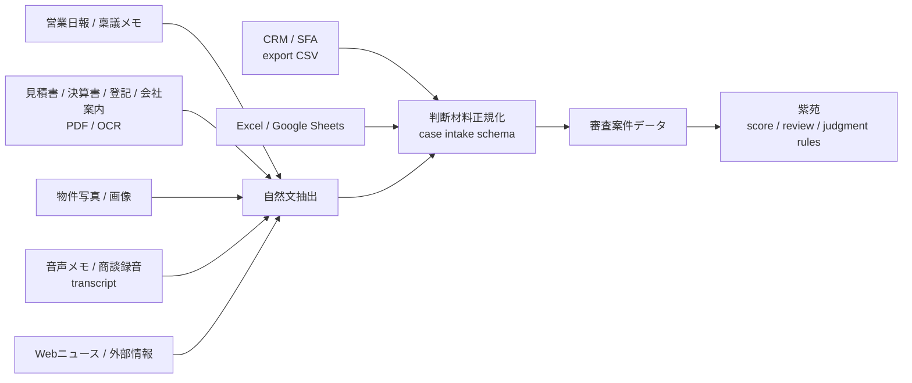

# Judgment Material Collection Plan

このメモは、紫苑が審査担当者に追加入力を強いるのではなく、既存業務の中にある情報から判断材料を集めるための今後の実装計画です。

## 目的

紫苑の価値は、AIが賢く答えることだけではない。現場で使われるためには、判断材料を自然に集める必要がある。

> 現場に新しい入力作業を増やさず、既存CRM・営業日報・稟議メモ・PDF・音声メモから判断材料を収集する。

これが次の実装テーマです。

## 基本方針

単一の入力フォームに依存しない。まずはCSVやExcelのような低コストな取り込みから始め、実証実験では各社の既存CRMエクスポートに合わせてマッピングする。

リース審査の現場は、最初からマルチモーダルな判断業務です。数値データ、営業日報、稟議メモ、見積書、決算書、登記、会社案内、物件写真、商談録音、Webニュース、過去案件ログが分散しており、人間はそれらを横断して判断しています。紫苑は Gemini のマルチモーダル能力を活用し、複数形式の業務情報を審査判断材料へ変換する設計に進めます。



## 入力経路

初期対応しやすい順:

1. 手入力フォーム
2. CSVインポート
3. Excel / Google Sheets テンプレート
4. CRMエクスポートCSV
5. 営業日報・稟議メモの自然文抽出
6. PDF / OCR
7. 物件写真・画像
8. 音声メモ・商談録音の文字起こし
9. Webニュース・外部情報
10. CRM API連携

候補CRM:

- kintone
- Salesforce
- HubSpot
- 各社独自CRM
- 稟議ワークフローシステム

## 取り込みスキーマ案

最初は完璧な業界共通スキーマを作らない。紫苑内部の審査に必要な項目へ寄せる。

```json
{
  "case_id": "external-or-generated-id",
  "company_name": "サンプル株式会社",
  "industry": "製造業",
  "asset_name": "工作機械",
  "lease_amount": 30000000,
  "lease_term_months": 60,
  "sales_memo": "補助金申請予定。受注先は既存大手。",
  "ringi_memo": "条件付き承認候補。補助金入金時期を確認。",
  "attached_documents": ["estimate.pdf", "financials.pdf"],
  "source": "crm_csv",
  "imported_at": "2026-07-12T13:00:00+09:00"
}
```

## 実装ステップ

1. CSVインポートの標準化

- `data/imports/` にCSVを置けるようにする
- `scripts/import_judgment_materials_csv.py` を追加する
- 会社名、業種、物件、金額、期間、営業メモ、稟議メモを正規化する

2. CRMエクスポートCSVのマッピング

- `config/crm_mapping/*.json` を用意する
- 列名の揺れを吸収する
- kintone / Salesforce / HubSpot / 独自CSVを同じ内部スキーマへ寄せる

3. 自然文メモの抽出

- 営業日報や稟議メモから、次を抽出する
  - 資金使途
  - 返済原資
  - 補助金・銀行支援
  - 物件の利用目的
  - 懸念点
  - 条件付き承認の候補条件

4. PDF / OCR連携

- 見積書、決算書、会社案内、登記、納税証明から審査項目を抽出する
- OCR結果は必ず人間が確認できるようにする
- confidenceが低い項目は自動確定しない

5. 音声メモ・商談録音

- 録音は主入力にしない
- 営業メモの補助情報として使う
- 文字起こし後に、判断材料候補だけを抽出する

6. API連携

- 実証実験でCSV運用が固まってから、必要なCRMだけAPI連携する
- 最初からAPI前提にしない

## 実証実験での言い方

AIのために入力してもらうのではなく、既存業務にある情報を紫苑が拾う。

> 審査担当者に追加入力を求めるのではなく、既存CRM・営業日報・稟議メモ・添付資料から判断材料を収集し、AIが審査観点へ整理することを目指します。

最初はCRM API連携ではなく、CSVエクスポートから始める。

> まずは既存CRMのCSVエクスポートで開始し、追加入力ゼロに近づけます。

## 安全境界

- 個人情報や機微情報を含む取り込みは、原則ローカルファーストで処理する
- Cloud Runへ載せるデモデータは匿名化・検疫済みにする
- CRM API連携は実証先の許可を得てから行う
- 音声録音は同意・保存期間・削除手順を明確にする
- OCR結果や自然文抽出結果を自動確定せず、人間確認を通す

## 最初の一歩

最初にやるべきことは、CRM連携そのものではない。

> CRMから出したCSVを紫苑の審査入力スキーマへ変換する。

これができれば、実証実験で「新しい入力作業を増やさない」方向へ進める。
