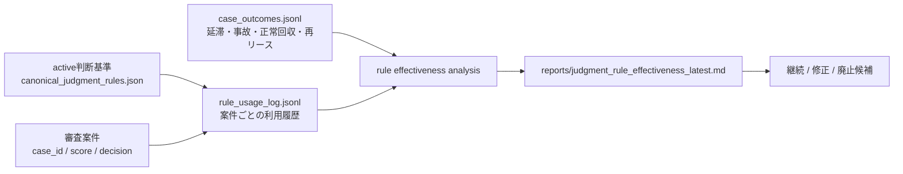

# Judgment Rule Effectiveness Plan

このメモは、紫苑が抽出した判断基準を「使って終わり」にせず、後から統計的に評価できるようにするための今後の実装計画です。

## 目的

紫苑の中核は、スコアリングの外側にある判断を経験として残し、次の判断を変えることです。

次の段階では、その判断基準が本当に効いたのかを検証する。

- 事故防止に寄与したか
- 条件付き承認の品質を上げたか
- 人間の説明責任を支えたか
- 業種・物件・スコア帯ごとに効き方が違うか
- AIが提案した判断基準と、人間が採用した判断基準で結果に差があるか

これは「判断の経験化」から「経験の統計的検証」へ進むための計画です。

## 基本方針

最初から大きな因果推論を狙わない。まずは、判断基準に安定IDを付け、案件で使われた履歴と後日結果を結びつける。



## 実装ステップ

1. 判断基準IDを安定させる

`data/canonical_judgment_rules.json` の active rules を、案件ごとに参照できる stable ID として扱う。

例:

```json
{
  "rule_id": "asset_life_and_residual",
  "content": "リース期間・残価判断では...",
  "status": "active"
}
```

2. 案件審査時に利用履歴を保存する

新規ログ案:

- `data/rule_usage_log.jsonl`

記録する項目:

- `case_id`
- `used_rule_ids`
- `suggested_rule_ids`
- `accepted_rule_ids`
- `rejected_rule_ids`
- `final_decision`
- `score_band`
- `industry_major`
- `asset_type`
- `created_at`

例:

```json
{
  "case_id": "20260712_xxx",
  "used_rule_ids": ["asset_life_and_residual", "conditional_approval_checks"],
  "suggested_rule_ids": ["subsidy_timing_check"],
  "accepted_rule_ids": ["asset_life_and_residual"],
  "final_decision": "条件付き承認",
  "score_band": "40-60",
  "industry_major": "製造業",
  "asset_type": "工作機械",
  "created_at": "2026-07-12T13:00:00+09:00"
}
```

3. 後日結果を保存する

新規ログ案:

- `data/case_outcomes.jsonl`

記録する項目:

- `case_id`
- `outcome_after_3m`
- `outcome_after_6m`
- `payment_delay`
- `default`
- `condition_met`
- `re_lease`
- `loss_amount`
- `updated_at`

例:

```json
{
  "case_id": "20260712_xxx",
  "outcome_after_6m": "正常",
  "payment_delay": false,
  "default": false,
  "condition_met": true,
  "re_lease": true,
  "updated_at": "2027-01-12T09:00:00+09:00"
}
```

4. ルール別に集計する

新規スクリプト案:

- `scripts/analyze_judgment_rule_effectiveness.py`

最初に出す指標:

- 使用回数
- 提案回数
- 人間採用回数
- 採用率
- 延滞率
- 事故率
- 条件達成率
- 正常回収率
- 人間修正率

5. 比較軸を追加する

最初の比較:

- ルール使用あり vs なし
- AI提案のみ vs 人間採用あり
- 業種別
- 物件別
- スコア帯別
- 条件付き承認案件だけ

データが増えた後の分析:

- Fisherの正確確率検定
- カイ二乗検定
- 平均差の検定
- ロジスティック回帰

例:

```text
事故発生 ~ score_band + industry_major + asset_type + rule_id
```

6. レポート化する

出力案:

- `reports/judgment_rule_effectiveness_YYYYMMDD.md`
- `reports/judgment_rule_effectiveness_latest.md`
- `reports/judgment_rule_effectiveness_latest.json`

Markdownに出す内容:

- 上位利用ルール
- 採用率が高いルール
- 事故率が低いルール
- 結果が悪いルール
- データ不足のルール
- 継続 / 修正 / 廃止候補

7. 画面化する

将来の画面案:

- `/rule-effectiveness`
- `/judgment-review` 内のタブ

表示内容:

- 判断基準一覧
- 使用回数
- 採用率
- 延滞率
- 事故率
- 条件達成率
- 有効性メモ
- 継続 / 修正 / 廃止候補

## 安全境界

- 統計結果だけで active 判断基準を自動昇格・自動廃止しない
- データ件数が少ない場合は「傾向」ではなく「参考値」と表示する
- 個人情報や機密情報は rule usage log に直接書かない
- 後日結果は demo / production を分離する
- 判断基準の変更は、これまで通り人間レビューを経由する

## 最初の一歩

最初にやるべきことは小さい。

> 案件審査時に、参照・提案・採用された判断基準IDを `rule_usage_log.jsonl` に残す。

これだけで、統計的評価への道が開く。
