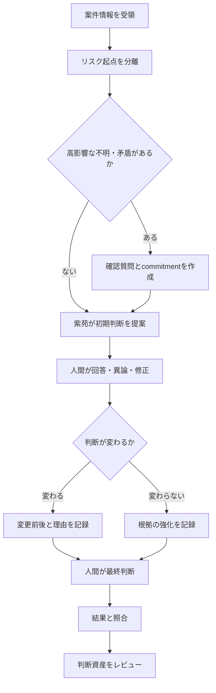

# 紫苑 Decision State Ledger 設計

- Status: Phase 1〜2 implemented / accumulation-only
- Created: 2026-09-14
- Scope: リース案件の判断文脈・状態変化・結果検証
- Initial mode: Observation-only sidecar

## 1. 目的

紫苑が保存すべき中心単位を「文書」や「会話全文」ではなく、案件の判断状態を変えた出来事にする。

この設計で、次の問いへ一つの時系列から答えられるようにする。

- なぜ現在の判断になったか。
- 何が分かって、判断がどう変わったか。
- どの前提が脆く、後で覆されたか。
- 誰が何を確認すると約束し、まだ何が未解決か。
- どの判断資産が使われ、役立ったか、覆されたか。

本設計はスコアリングモデルを置き換えない。自動承認・自動否決も行わない。人間と紫苑の判断過程を、後から検査・修正・再利用できる状態にする。

## 2. 設計原則

### 2.1 状態変化だけを共通台帳へ入れる

会議録、Slack、Obsidianノート、案件DBは原資料として残す。共通台帳には、原資料から生じた次の変化だけを記録する。

- 前提が生まれた、修正された、崩れた。
- 不明点が質問され、回答された。
- 判断が提案され、変更され、確定された。
- 確認事項や条件が発生し、完了または失効した。
- 結果が判明した。
- 判断資産が使われ、評価された。

### 2.2 追記式で、過去を書き換えない

イベントは不変とする。誤記は削除・上書きせず、`event_corrected` を追記して訂正する。現在状態はイベント列から再構築できなければならない。

### 2.3 事実の正本を奪わない

- 財務数値・案件属性の正本: 既存案件DB。
- 原文・会話・ノートの正本: 既存ログまたはObsidian。
- 判断資産本文の正本: `data/canonical_judgment_rules.json`。
- 判断状態の変遷と理由の正本候補: Decision State Ledger。

初期段階ではLedgerを観測用サイドカーとし、既存DBの現在値を変更しない。再生精度と運用性が確認できた後だけ、判断履歴の正本へ昇格する。

### 2.4 人間判断を一級市民にする

高影響な最終判断は、`actor.type=human` のイベントがなければ `final` にしない。AIの出力は `proposed` に限定し、人間の承認・修正・却下と区別する。

### 2.5 保存と利用を分離する

イベントを書いたことだけを理由に、RAG順位、審査スコア、承認可否、判断資産の昇格を変えない。利用は後段の明示的なprojection・review gateを通す。

### 2.6 会話全文を保存しない

保存対象は、理由の短い要約、前提、異論、捨てた代替案、コミットメント、出典参照である。生の会話は既存の権限管理された原資料を参照する。

## 3. 論理アーキテクチャ

```text
案件画面 / 紫苑レビュー / 人間修正 / 結果登録 / 判断資産評価
                         │
                         ▼
               Event Recorder + Validator
                         │
             ┌───────────┴───────────┐
             ▼                       ▼
   Local append-only JSONL     Cloud Run GCS writeback
             │                       │
             └───────────┬───────────┘
                         ▼
                 Deduplicate / Sync
                         │
                         ▼
              Canonical normalized ledger
                         │
              ┌──────────┼──────────┐
              ▼          ▼          ▼
        Current State  Timeline   Memory candidates
        projection     projection  (review required)
              │          │          │
              ▼          ▼          ▼
        案件画面      「なぜ？」UI  既存判断資産ループ
```

### 保存先案

- ローカル正規ミラー: `data/judgment_state_events.jsonl`
- 再構築可能な現在状態: `data/judgment_state_current.json`
- Cloud Run: 既存 `record_cloudrun_input_event()` を使い、`event_type=judgment_state_event` としてGCSへ追記
- 同期: 既存 `scripts/sync_cloudrun_inputs_from_gcs.py` で `event_id` による重複排除
- 人間向け表示: Obsidianへ全文複製せず、必要時に案件別タイムラインをMarkdownへ出力

`judgment_state_current.json` は派生物であり、いつでもLedgerから再構築できるものとする。

## 4. 共通イベントスキーマ

```json
{
  "schema_version": "1.0",
  "event_id": "jse_01J...",
  "idempotency_key": "screening-review:483:decision_changed:v1",
  "occurred_at": "2026-09-14T10:30:00+09:00",
  "recorded_at": "2026-09-14T10:30:02+09:00",
  "event_type": "decision_changed",
  "aggregate": {
    "type": "case",
    "id": "case_123"
  },
  "actor": {
    "type": "human",
    "role": "screening_officer",
    "id": "user"
  },
  "surface": "screening_review",
  "transition": {
    "subject": "decision",
    "action": "revised",
    "from": {
      "stance": "approve",
      "confidence": 0.72
    },
    "to": {
      "stance": "conditional",
      "confidence": 0.84
    }
  },
  "context": {
    "reason_summary": "補助金不採択時の代替返済原資が未確認",
    "fragile_assumptions": [
      "補助金が予定どおり採択される"
    ],
    "alternatives_rejected": [
      {
        "option": "無条件承認",
        "reason": "返済原資が補助金採択へ依存している"
      }
    ],
    "dissent": [],
    "constraints": [
      "採択前に実行しない"
    ]
  },
  "relations": {
    "caused_by": ["jse_01H..."],
    "supersedes": [],
    "correlation_id": "review_483"
  },
  "evidence_refs": [
    {
      "kind": "screening_review",
      "id": "483",
      "locator": "db://shion_screening_reviews/483",
      "quote_policy": "summary_only"
    },
    {
      "kind": "judgment_asset",
      "id": "0d0f11e77fba045d",
      "locator": "data/canonical_judgment_rules.json",
      "quote_policy": "allowed"
    }
  ],
  "governance": {
    "visibility": "screening_team",
    "contains_pii": false,
    "human_review_required": true,
    "retention_class": "decision_audit"
  },
  "payload": {
    "open_commitment_ids": ["commitment_456"]
  }
}
```

### 必須フィールド

| フィールド | 意味 |
|---|---|
| `event_id` | 全経路で一意なイベントID |
| `idempotency_key` | 再送・同期時の二重登録防止 |
| `occurred_at` | 実際に判断・回答・結果が発生した時刻 |
| `recorded_at` | 台帳へ保存した時刻 |
| `event_type` | 状態変化の種類 |
| `aggregate` | 主対象。初期は原則 `case` |
| `actor` | 人間、紫苑、システム、外部情報源の区別 |
| `transition` | 何が、どの状態からどの状態へ変わったか |
| `context.reason_summary` | 状態変化が起きた理由 |
| `evidence_refs` | 原資料・判断資産への参照 |
| `governance` | 閲覧・引用・人間確認の境界 |

`occurred_at` と `recorded_at` を分けることで、後日入力された結果や遡及登録を正しく扱う。

## 5. 初期イベント語彙

初期実装は、上位イベントを6種類に限定する。細かな違いは `transition.action` で表す。

| `event_type` | `transition.action` | 用途 |
|---|---|---|
| `case_context_changed` | `created / updated / corrected` | 審査に効く案件文脈が追加・訂正された |
| `assumption_changed` | `created / strengthened / weakened / invalidated` | 前提の生成・変化・崩壊 |
| `decision_changed` | `proposed / revised / finalized / reopened` | AI提案、人間修正、最終判断、再審査 |
| `commitment_changed` | `opened / assigned / completed / cancelled / overdue` | 確認条件・追加資料・フォローアップ |
| `outcome_recorded` | `observed / corrected` | 成約、失注、延滞、条件履行などの結果 |
| `judgment_asset_evaluated` | `used / helped / challenged / rejected / neutral` | 判断資産の実戦評価 |

イベント自体の誤りを直す場合だけ、横断イベント `event_corrected` を使う。

## 6. 状態モデル

案件の現在状態は、イベントを時系列にreplayして作る。

```json
{
  "case_id": "case_123",
  "as_of_event_id": "jse_01J...",
  "current_decision": {
    "stance": "conditional",
    "confidence": 0.84,
    "status": "final",
    "decided_by": "human"
  },
  "assumptions": [
    {
      "id": "assumption_1",
      "statement": "補助金が予定どおり採択される",
      "status": "weakened"
    }
  ],
  "open_commitments": [
    {
      "id": "commitment_456",
      "action": "未採択時の代替資金繰りを確認",
      "owner_role": "sales",
      "status": "open"
    }
  ],
  "latest_outcome": null,
  "judgment_asset_refs": ["0d0f11e77fba045d"]
}
```

### Reducer規則

1. `event_corrected` で無効化されたイベントは現在状態へ適用しない。ただし監査履歴には残す。
2. 同じ `idempotency_key` は最初の有効イベントだけを採用する。
3. `occurred_at`、`recorded_at`、`event_id` の順で決定的に並べる。
4. `decision_changed.finalized` は人間actorだけを受け付ける。
5. 完了・取消済みコミットメントはopen一覧から外すが、履歴は消さない。
6. outcomeは過去の判断を自動的に正解・不正解へ変換しない。評価イベントは人間レビュー後に別途記録する。

## 7. 審査判断フロー

メインフローは9ノード以内に保ち、例外は質問・保留へ逃がす。

1. `[start]` 案件情報を受け取る。
2. `[fact]` 財務、物件、取引、競争、書類、入力整合性を分離する。
3. `[decision]` 高影響な不明・矛盾があるか。
   - ある → `[question]` 最大3件の確認質問とcommitmentを作る。
   - ない → 初期判断へ進む。
4. `[action]` 紫苑が根拠・前提付きの初期判断を `proposed` として記録する。
5. `[question]` 人間が回答・異論・修正を入力する。
6. `[decision]` 回答で判断状態が変わるか。
   - 変わる → 変更前後と理由を `revised` として記録する。
   - 変わらない → 根拠が強まった事実だけを記録する。
7. `[action]` 人間が承認・条件付・保留・否決を確定する。
8. `[action]` 後日結果を記録し、当時の前提・判断資産と照合する。
9. `[end]` 人間レビュー後に判断資産を強化・改訂・却下する。



## 8. 「なぜ？」への回答生成

「なぜこの判断になった？」に対して全文検索を先に行わず、現在の `decision_changed.finalized` から `caused_by` を逆向きに辿る。

回答順は固定する。

1. 現在の判断。
2. 直前から何が変わったか。
3. 変更を引き起こした回答・事実。
4. 捨てた代替案と理由。
5. まだ脆い前提と未完了commitment。
6. 出典。

表示例:

> 条件付き承認です。当初は承認寄りでしたが、補助金不採択時の代替返済原資が確認できなかったため変更しました。無条件承認は、返済計画が採択へ依存するため見送りました。営業による代替資金繰りの確認が未完了です。

## 9. 既存構造との接続

| 既存構造 | 接続方法 |
|---|---|
| `judgment_feedback.py` | 人間がAI判断を修正した時、`decision_changed.revised` を副作用なしで追記 |
| `data/judgment_asset_usage_feedback.jsonl` | 各行を `judgment_asset_evaluated` へ正規化。元ファイルは当面維持 |
| `data/shion_memory_revisions.jsonl` | 案件に紐づく改訂だけ `assumption_changed` または資産評価へ参照接続 |
| `api/shion_experience_loop.py` | 人格・対話経験のイベントとして維持。案件判断Ledgerへ統合しない |
| `api/cloudrun_writeback.py` | Cloud Run由来イベントの配送路として再利用 |
| `data/shion_memory_index.json` | Ledgerそのものを全文索引化せず、人間レビュー済みの派生記憶だけを取り込む |
| Obsidian | 人間向けタイムライン、決定メモ、出典閲覧面として使う。正本イベントを複製しない |

`shion_experience_events.jsonl` は「紫苑自身の応答状態」、Decision State Ledgerは「案件判断の業務状態」であり、混ぜない。

## 10. 権限・プライバシー

### 可視性

- `private`: 入力本人と明示的に許可された処理だけ。
- `screening_team`: 審査担当内。
- `sales_and_screening`: 営業・審査間で共有可能。
- `demo_safe`: 匿名化済みで公開デモへ使用可能。

### 引用方針

- `allowed`: 原文引用可能。
- `summary_only`: 内容は要約できるが原文引用しない。
- `aggregate_only`: 集計へ使用できるが個別内容を表示しない。
- `no_reuse`: 監査保存のみ。RAG・回答には使用しない。

個人評価・人事査定のためのactor別ランキングは作らない。actorは説明責任と訂正可能性のために保存し、社員評価へ転用しない。

## 11. 不変条件

実装は次を必ず守る。

1. Ledgerを空からreplayすれば同じ現在状態になる。
2. 既存イベントを上書き・削除しない。
3. 最終判断には人間actorが必要。
4. 状態変更理由と最低1件の出典参照がない `decision_changed` は受け付けない。
5. privateまたは`no_reuse`の内容を通常RAGへ入れない。
6. 結果だけで判断資産を自動昇格・自動却下しない。
7. Ledger障害で審査画面やチャット回答を失敗させない。記録失敗は可視化し、業務本流は継続する。
8. 同じ送信の再試行でイベントを重複させない。

## 12. 導入段階

### Phase 0: 設計固定

- 本文書をレビューする。
- イベント語彙、必須項目、権限語彙を固定する。
- 既存の正本を変更しない。

### Phase 1: 観測専用Recorder

Status: implemented on 2026-09-14

- `decision_state_ledger.py` を追加する。
- schema validation、PII最小化、追記、重複排除を実装する。
- 既存の人間判断修正と判断資産評価からイベントを並行記録する。
- プロンプト、スコア、画面表示は変えない。

### Phase 2: Replayと監査レポート

Status: implemented on 2026-09-14

- `scripts/build_judgment_state_projection.py` を追加する。
- 案件別現在状態とタイムラインを再構築する。
- 欠けた理由、孤立参照、未完了commitment、矛盾するfinal判断を監査する。

### Phase 3: 人間向け「なぜ？」画面

Status: paused until the accumulation gate is met and User explicitly approves

- 案件画面に「判断の変遷」を追加する。
- 現在判断、変更理由、脆い前提、捨てた代替案、未完了確認、出典を表示する。
- 訂正は既存行編集ではなく訂正イベントとして受け付ける。

### Phase 4: 参加する記憶

- 類似案件で、文書ではなくレビュー済みの判断変遷を最大3件提示する。
- 「過去と同じ結論」を強制せず、現在案件との相違点を先に出す。
- 人間の `helped / challenged / rejected` を次回想起順位の弱い補助値として使う。

### Phase 5: 結果検証

- outcomeと当時の前提・確認条件を照合する。
- 効いた判断、見逃した反証、復活候補をレビューキューへ出す。
- 人間承認後だけ既存判断資産の強化・改訂へ送る。

## 13. 最初の実装単位

最初は次の一本だけをend-to-endで通す。

```text
紫苑レビューのAI判断
→ 人間が判断を修正
→ 修正前後・理由・参照資産をイベント化
→ 案件別タイムラインを再構築
→ 「なぜ変わったか」を表示
```

この段階では会議・Slack・Notionの全取り込みを行わない。既に構造化され、権限境界が明確な紫苑レビューから始める。

## 14. 受入条件

- 同じイベント集合を順序を変えて入力しても、決定規則に従い同じprojectionになる。
- 同じ `idempotency_key` を2回送っても1イベントとして扱われる。
- AI提案だけでは最終判断にならない。
- 人間修正前後と理由が、案件別タイムラインで1分以内に確認できる。
- 訂正前イベントと訂正理由の両方が監査できる。
- private出典の本文が通常画面・デモ索引へ出ない。
- Ledger書き込み失敗時も既存審査処理は成功し、失敗が別ログで検知できる。
- LedgerをRAG・スコアへ接続しなくてもPhase 1と2が完結する。

## 15. 採用判断

この設計を採用する価値は、保存件数ではなく次の指標で判定する。

- 「なぜこの判断か」を探す時間が減ったか。
- 判断変更の理由が欠けた案件割合が下がったか。
- 未完了commitmentの放置が減ったか。
- 後日の結果から、脆かった前提を特定できたか。
- 類似案件で同じ質問を繰り返す回数が減ったか。

これらが改善しなければ、イベント種別や取得範囲を増やさない。
