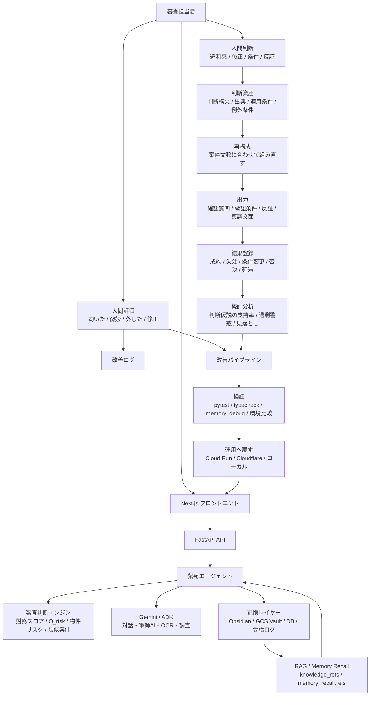
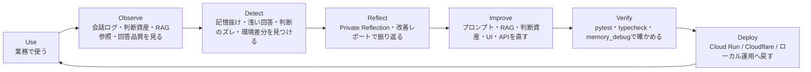

# システム構成案: 紫苑システム

## 概要

**紫苑システム**は、リース審査AIを実証フィールドにした、業務AIエージェントDevOpsの実証プロトタイプです。

普通の審査AIは、スコアリングやコメント生成で終わりがちです。  
しかし実務では、スコアの後に人間が迷い、条件を付け、反証を考え、説明責任を持ちます。

紫苑は、その人間の判断を使い捨てにしません。

営業メモ、過去判断、違和感、条件付き承認の理由、AIとの対話ログ、人間の修正を記録し、次の審査で再利用できる **判断構文** へ変換します。

つまり紫苑は、単なる記憶するAIではありません。

**人間の判断をAIが再利用できる形に変え、案件で試し、人間評価と結果データで更新する、判断プロンプトのPDCA基盤** です。

> 数字の向こうに、あなたの判断がある。  
> 紫苑は、それを次の審査へ戻す。

---

## システム全体像



---

## DevOpsループ



---

## 主な構成要素

| レイヤー | 役割 | 実装例 |
|---|---|---|
| UI | 審査入力、AIチャット、紫苑レビュー、判断資産、改善ログを表示 | Next.js |
| API | スコアリング、対話、OCR、判断資産、記憶参照を統合 | FastAPI |
| AI Agent | 違和感、条件、反証、稟議文面を生成 | 紫苑 / Gemini / ADK |
| Judgment | 財務数値と非財務情報を合わせて審査判断を支援 | RandomForest, LogisticRegression, Q_risk |
| Judgment Asset | 人間判断を再利用可能な構文として保存 | 判断資産候補 / edited_claim / 出典ID |
| Memory | 営業メモ、過去判断、対話、改善ログを保存 | Obsidian, SQLite/PostgreSQL, GCS Vault |
| Observability | 記憶や判断資産が回答に効いたかを見る | memory_debug, knowledge_refs, memory_recall.refs |
| Feedback | 人間評価と結果を記録する | 効いた / 微妙 / 外した / 修正 / 成約 / 失注 |
| DevOps | 改善候補を検証し、運用環境へ戻す | pytest, typecheck, Cloud Run, Cloudflare |

---

## 何が新しいか

一般的なRAGエージェントは、社内文書や会話履歴を検索して回答します。

紫苑システムでは、それに加えて、**記憶や判断資産が本当に判断に効いたか** を観測します。

- RAG参照が空ではないか
- 参照した記憶が回答に反映されたか
- 人間が「薄い」「違う」と感じた回答は改善ログへ戻ったか
- 判断資産が確認質問・承認条件・反証・稟議文面に変換されたか
- 使った判断資産に出典が残っているか
- 人間が `効いた / 微妙 / 外した / 修正` を返したか
- 結果登録と結びつけて後から分析できるか

紫苑は、単に記憶するAIではありません。

**人間の判断を、LLMが実行できる判断コードへ変えるAI** です。

---

## 判断資産の型

紫苑が扱う判断資産は、単なるメモではありません。

次のような半構造化された判断構文です。

```text
条件 → 見る論点 → 稟議に残す一文 → 使わない条件
```

例:

```text
補助金採択前提の設備案件では、未採択時でもリース料を払える代替返済原資を確認する。
稟議には「補助金未採択時は自己資金・銀行借入・営業CFで支払可能な資金繰り表提出を条件とする」と残す。
ただし補助金を返済原資に含めていない場合は簡略化できる。
```

これは通常の `if A then B` ではありません。

業種、物件、資金使途、競合、顧客背景によって意味が変わる、人間の判断コードです。  
LLMだからこそ、この半構造化された判断を案件文脈に合わせて再構成できます。

---

## リース審査での使い方

1. 審査担当者が企業情報・物件・営業メモを入力する
2. AIが財務スコア、物件リスク、Q_risk、類似案件を確認する
3. Obsidianや過去ログから、数字に表れない判断材料を呼び戻す
4. 紫苑が確認質問、承認条件、反証、稟議文面を出す
5. 担当者が違和感や修正を判断資産として保存する
6. 紫苑が次の案件で判断資産を再構成して使う
7. 担当者が `効いた / 微妙 / 外した / 修正` を返す
8. 成約、失注、条件変更、否決、延滞などの結果と結びつける
9. 後から、どの判断構文が効いたかを統計的に分析する

---

## 将来的な汎用化

現在はリース審査AIとして運用していますが、中核はドメイン非依存です。

本システムは Cloud Run / FastAPI を実行基盤とし、Gemini API と ADK によってリース審査AIエージェント「紫苑」を構成しています。

他業務へ展開する場合は、主に次の部分を差し替えます。

| 差し替えるもの | リース審査での例 | 他業務での例 |
|---|---|---|
| ドメイン知識 | リース判断、過去案件、物件リスク | 契約条文、営業ナレッジ、CS対応履歴 |
| 判断構文 | 承認条件、反証、稟議文面 | 契約リスク、商談次アクション、回答方針 |
| 評価基準 | 条件付き承認、失注理由、延滞有無 | 誤回答率、契約見落とし、成約率、再問い合わせ |
| UI | 審査入力画面、稟議コメント | 契約レビュー画面、営業支援画面、CS画面 |
| 役割プロンプト | リース審査の紫苑 | 法務レビュアー、営業コーチ、CS品質監査役 |

残る骨格は、**Observe → Detect → Reflect → Improve → Verify → Deploy** のDevOpsループです。

---

## 一言でいうと

紫苑システムは、普通ならスコアリングで終わるリース審査AIの先に進みます。

スコアの後に残る人間の迷い、修正、条件、反証を、AIが再利用できる判断構文へ変換する。

そして、それを案件で試し、人間が評価し、結果と結びつけ、後から統計的に検証する。

紫苑は、人間の判断力を不要にするAIではありません。

**人間の判断性能を増幅する、判断プロンプトのPDCA基盤です。**
