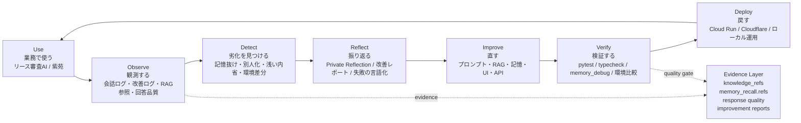

# Hackathon DevOps Diagram

## 図: AIエージェントのDevOpsループ

## 動画冒頭用の一文

DevOpsとは、作って終わりではなく、使われた結果を観測し、問題を検知し、改善し、検証して、また本番へ戻す継続的な運用ループです。

このプロジェクトでは、そのDevOpsをAIエージェント自身に適用しました。

## 図の説明

普通のAIデモは「回答できる」で終わります。

このシステムは、リース審査AIの回答、記憶参照、改善ログ、内省、環境差分を観測し、問題を検知して、プロンプト・RAG・UI・APIを改善し、テストして再デプロイするところまでを1つのループにしています。

つまりこれは、AIを作るだけではなく、AIを運用しながら賢くし続けるDevOps基盤です。

## 対応表

| DevOpsの言葉 | このプロジェクトでの意味 |
|---|---|
| Observe | 会話ログ、改善ログ、RAG参照、回答品質を見る |
| Detect | 記憶抜け、浅い内省、別人化、環境差分を見つける |
| Reflect | Private Reflection、改善レポート、失敗の言語化 |
| Improve | プロンプト、RAG、記憶、UI、APIを修正 |
| Verify | pytest、typecheck、memory_debug、Cloud Run / Cloudflare比較 |
| Deploy | Cloud Run、Cloudflare、ローカル運用へ戻す |

