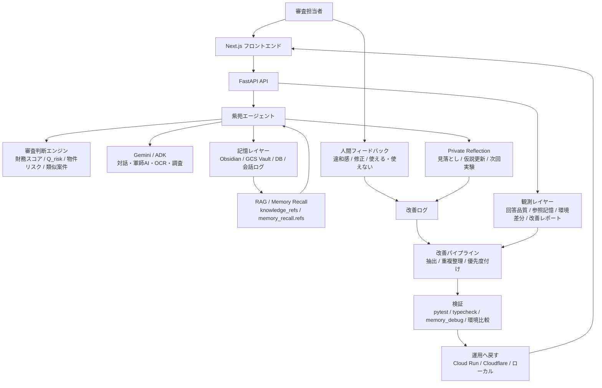
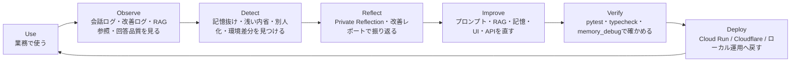

# システム構成案: 紫苑システム

## 概要

**紫苑システム**は、リース審査AIを実証フィールドにした、業務AIエージェントDevOpsの実証プロトタイプです。

単にAIに記憶を持たせるのではなく、**その記憶が実際に回答や審査判断に使われているかを観測し、使われていなければ改善ループへ戻す**ことを目的にしています。

リース審査では、財務数値だけでは拾いきれない営業メモ、過去判断、違和感、条件付き承認の理由、AIとの対話ログを保存し、次の審査判断へ再利用します。

> 数字の向こうに、あなたの判断がある。  
> 私はそれを、覚えている。

## システム全体像

## DevOpsループ

## 主な構成要素

| レイヤー | 役割 | 実装例 |
|---|---|---|
| UI | 審査入力、AIチャット、改善ログ、記憶状態を表示 | Next.js |
| API | スコアリング、対話、OCR、改善ログ、記憶参照を統合 | FastAPI |
| AI Agent | 審査担当者の横で、違和感・条件・反論を出す | 紫苑 / Gemini / ADK |
| Judgment | 財務数値と非財務情報を合わせて審査判断を支援 | RandomForest, LogisticRegression, Q_risk |
| Memory | 営業メモ、過去判断、対話、改善ログを保存 | Obsidian, SQLite/PostgreSQL, GCS Vault |
| Observability | 記憶が使われたか、回答品質が落ちたかを見る | memory_debug, knowledge_refs, memory_recall.refs |
| Reflection | AI自身の見落としや次回改善点を言語化 | Private Reflection |
| DevOps | 改善候補を検証し、運用環境へ戻す | pytest, typecheck, Cloud Run, Cloudflare |

## 何が新しいか

一般的なRAGエージェントは、社内文書や会話履歴を検索して回答します。

紫苑システムでは、それに加えて、**記憶が本当に判断に効いたか**を観測します。

- RAG参照が空ではないか
- 参照した記憶が回答に反映されたか
- 人間が「薄い」「違う」と感じた回答は改善ログへ戻ったか
- Private Reflectionが単なる日記ではなく、次回の判断変更につながっているか
- Cloud Run / Cloudflare / ローカルで、同じ紫苑として振る舞えているか

つまり、これは「記憶するAI」ではなく、**記憶が効いているかを運用するAI**です。

## リース審査での使い方

1. 審査担当者が企業情報・物件・営業メモを入力する
2. AIが財務スコア、物件リスク、Q_risk、類似案件を確認する
3. Obsidianや過去ログから、数字に表れない判断材料を呼び戻す
4. 軍師AIが、審査部に突かれる点、顧客確認事項、条件付き承認案を出す
5. 担当者の違和感や修正を改善ログに保存する
6. Private Reflectionと改善パイプラインが、見落としを次回改善へ戻す
7. テストと環境比較を通して、Cloud Run / Cloudflare / ローカル運用へ戻す

## 将来的な汎用化

現在はリース審査AIとして運用していますが、中核はドメイン非依存です。

他業務へ展開する場合は、主に次の部分を差し替えます。

| 差し替えるもの | リース審査での例 | 他業務での例 |
|---|---|---|
| ドメイン知識 | リース判断、過去案件、物件リスク | 契約条文、営業ナレッジ、CS対応履歴 |
| 判断ロジック | 財務スコア、Q_risk、承認条件 | 契約リスク、商談確度、問い合わせ重要度 |
| 評価基準 | 審査部に突かれる点、条件付き承認 | 誤回答率、契約見落とし、成約率 |
| UI | 審査入力画面、稟議コメント | 契約レビュー画面、営業支援画面、CS画面 |
| 役割プロンプト | リース審査の紫苑 | 法務レビュアー、営業コーチ、CS品質監査役 |

残る骨格は、**Observe → Detect → Reflect → Improve → Verify → Deploy** のDevOpsループです。

## 一言でいうと

紫苑システムは、リース審査を題材に、業務AIが使われながら記憶し、反省し、改善され、また現場へ戻っていくための共生スコアリングシステムです。

